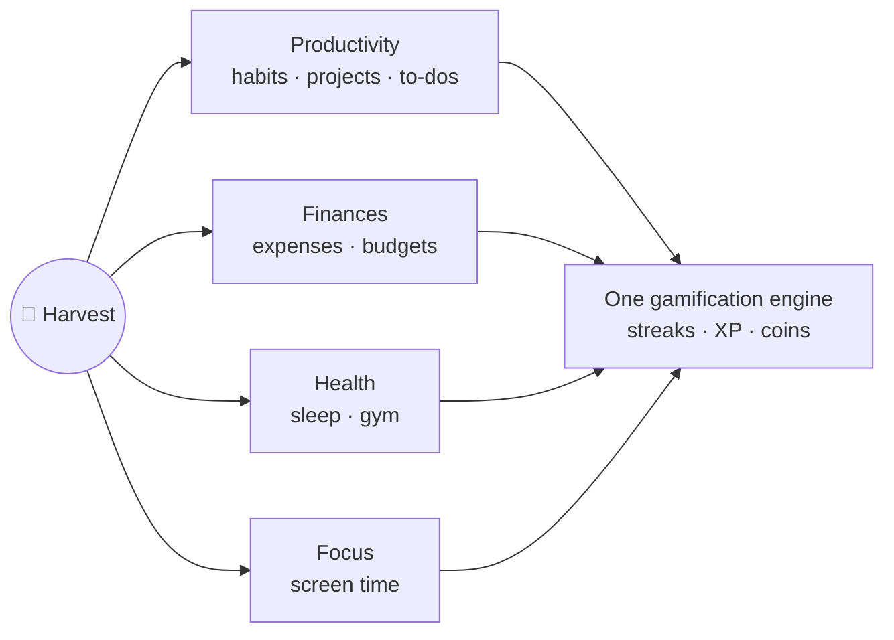

# Vision

## Where this comes from

No matter how chaotic my life gets, I always find time for my Duolingo lesson — just to keep the streak alive. That streak is an anchor: it pulls me back every single day. But Duolingo only asks for *one lesson*. There's no way to push myself further, to gradually raise the bar, and it only covers one narrow slice of my life.

Harvest is my answer: a single app where that same streak psychology spans **everything** — my commitments, my money, my body, my attention. It should ease me away from procrastination and remind me of what matters, **without ever feeling like a trap**. Regaining control, not adding anxiety.

## What it must feel like

- **A game, not a chore.** The look and feel borrows from Duolingo — playful, warm, alive — but the UX stays minimalist and straight to the point. No clutter, no dark patterns.
- **An anchor, not a leash.** Missing a day should sting a little (streak!), never punish or shame.
- **Gradually harder.** Unlike Duolingo's fixed one-lesson bar, my daily bar is mine to raise: more pages, more sessions, tighter budgets.
- **Mine.** All data lives on my device first. Sync is a convenience layered on later, never a requirement. See [[Sync-Strategy]].

## The four pillars

One streak, one XP pool, one daily ritual — fed by every pillar. That's the whole trick.

## Scope discipline

The MVP is the productivity core **only** ([[Phase-1-Productivity-Core]]): commitments (recurring and daily), the reminder ritual to plan tomorrow before sleep or after waking, streaks and tracking, plus the [[Pomodoro]] timer as a built-in tool. Everything else arrives in later phases — see the [[Roadmap]].

Related: [[Product-Requirements]] · [[Glossary]]
