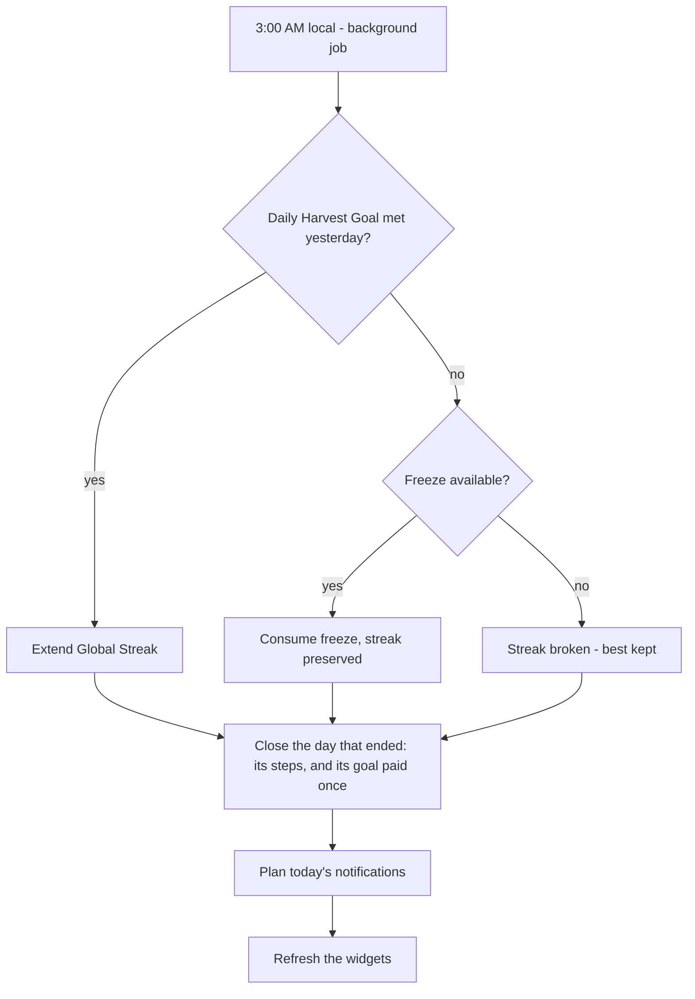

# Business Rules — Immutable

These rules are the app's constitution. Any feature that conflicts with them is wrong, not the rule.

| # | Rule | Detail |
| :-- | :--- | :--- |
| 1 | **Harvest Day = 3 AM → 3 AM local** | The day resets at 3:00 AM to accommodate night owls: a log at 1 AM counts for the *previous* day. Every date-keyed record stores its Harvest Day, computed once at write time. |
| 2 | **Over-log cap: 2×** | A Project cannot receive more than 2× its daily commitment in one Harvest Day, nor more than what is left of its total; a daily commitment larger than the total is refused when planting. What a cap leaves out is said, not swallowed. One rule, `roomToday`, shared by both clients. Prevents cheating the streak and binge-burnout. |
| 3 | **Sleep debt is minute-for-minute** | Owe 1 h, sleep 30 min over target → owe 30 min. No multipliers, no decay tricks. It never goes below zero — a twelve-hour Sunday clears what is owed and does not put me in credit — it looks back fourteen **calendar** nights ending today — not the fourteen most recent nights I happened to log — and a night nobody logged counts for **nothing in either direction**: an unlogged night is unknown, not a failure, and it still passes. Each night is judged against the target it had at the time, so changing my hours never rewrites last month — and correcting a night later keeps that target, and its note. |
| 4 | **Streak freezes apply automatically** | At the 3 AM reset, a missed Daily Harvest Goal consumes a stored freeze (max 2 stored) before breaking the streak. |
| 5 | **Local-first, always** | Every feature must be fully functional with no network, forever. Sync ([[Sync-Strategy]]) is additive. |
| 6 | **Financial privacy** | Expense data stays on-device; if synced later, end-to-end encrypted only. Never shared, never sold. |
| 7 | **Blocking is self-imposed** | Screen-time locks are always escapable by deliberate action ([[Screen-Time]]). No dark patterns anywhere. |
| 8 | **History is append-only. What is not history is not kept** | Anything that records something that happened — a check-in, an expense, a night, a session, a step day — is soft-deleted and purged thirty days later, and retiring a seed never destroys its history at all: that is what **Archive** is for, and it keeps every check-in and every note ([[Checkpoint-3]]). Four things go for good on the spot, because none of them is a record of anything: **the seed I planted by mistake** (deliberate, confirmed, taking its check-ins, its notes and its streak with it), **a note emptied from the trash** and the links out of it, **an album purged** with its pictures, and **structure I am editing** — a program's days, slots and target sets, a set dropped from a session, a note taken off a seed. A confirm dialog says what each costs and offers Archive where there is one ([[Audit-v2]] D3-01). |
| 9 | **Rituals: four a day, and silent once there is nothing to say** | The daily rituals — morning review, evening plan, expense check-in, streak-risk nudge — are the cap. Two of them have a reason that can disappear during the day, and those two are cancelled the moment it does: the streak-risk nudge once the Daily Harvest Goal is met, and the expense check-in once an expense is logged. The morning review and the evening plan have no such condition — a day I have already reviewed is not a day I cannot review again — so they fire as planned ([[Notifications]], [[Audit-v2]] D3-05). The comeback ladder counts against the cap: on a day one of its rungs fires it **replaces** the morning ritual rather than stacking on it. A time I set on a seed, an album or a debt by hand is not a ritual and always fires ([[Audit-v2-Beta]] B-11). |
| 10 | **The lock is the device's, not mine** | The app lock ([[Checkpoint-2]]) is off by default and, when armed, defers entirely to whatever the phone already trusts — fingerprint, face, PIN, pattern, password. Harvest never stores a secret of its own, and never invents a PIN screen. |
| 11 | **My data is always exportable, and comes back** | One tap produces an archive holding every row the database has, soft-deleted ones included, plus every file — notes as markdown, memories as pictures ([[ADR-006-Export-Format]], [[ADR-007-Archive-Format]]). No feature may add a table the export does not carry, or a file the archive does not hold. From Phase 3 the archive also **imports**: a merge by uuid that never deletes what it did not bring. The web writes and reads the same archive, so either one restores the other ([[Web]]). |
| 12 | **Nothing is due before it was planted** | A schedule describes a rhythm, not a history. Every seed carries a **start day** — the Harvest Day it was created — and no screen, streak or reminder may treat it as due on any day before that. One rule, `isDueOn`, enforces it for the field, the calendar and the planner alike ([[Checkpoint-3]]). |
| 13 | **Nothing leaves the device unless I ask** | The app makes no outbound request that I did not turn on. The complete list: the exchange-rate fetch I tap (`api.frankfurter.dev`, carrying nothing); an exercise animation I open ([[ADR-008-Exercise-Catalogue]]), a GET for a static file with no account, device id or history; map tiles while I look at [[Places]] — OpenFreeMap for the streets and its fonts, Esri World Imagery for the satellite base (they learn the area on screen, never the trail — [[ADR-010-Maps]]); an assist action I tap, carrying exactly what its sheet names ([[ADR-013-Assist-Providers]]); and sync, once I have signed in to an account ([[Sync-API]]), with the private tier encrypted before it leaves. An export is a file I move, not a request. The web keeps the same list and no other; its site says so in a Content-Security-Policy that allows these hosts and nothing else ([[Deployment]]). Anything else is a bug, not a feature ([[Audit-v2]] D3-03). |
| 14 | **Reference data is not my data** | The exercise catalogue is borrowed, read-only and bundled. It never migrates, never syncs and never exports; a log refers to it by id. What I write myself — my own exercises included — is mine and travels with me. |

## The 3 AM reset job

Runs via `workmanager`. Android only, because there is no `ios/` in
the repo yet; if the device was off, the same reconciliation runs
lazily on next app open — the logic is idempotent per Harvest Day.
The floating budget is recomputed whenever it is read, from history,
so no job has to remember to; quests are parked ([[Gamification]],
[[Audit-v2]] D3-04). See [[Notifications-and-Background]].
