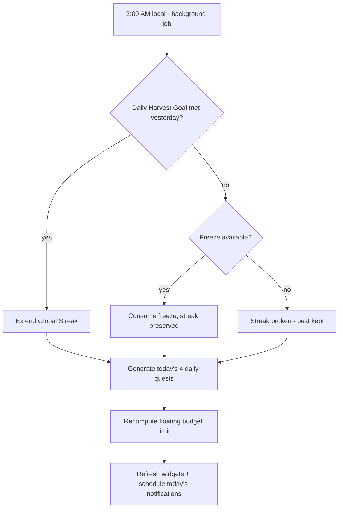

# Business Rules — Immutable

These rules are the app's constitution. Any feature that conflicts with them is wrong, not the rule.

| # | Rule | Detail |
| :-- | :--- | :--- |
| 1 | **Harvest Day = 3 AM → 3 AM local** | The day resets at 3:00 AM to accommodate night owls: a log at 1 AM counts for the *previous* day. Every date-keyed record stores its Harvest Day, computed once at write time. |
| 2 | **Over-log cap: 2×** | A Project cannot receive more than 2× its daily commitment in one Harvest Day. Prevents cheating the streak and binge-burnout. |
| 3 | **Sleep debt is minute-for-minute** | Owe 1 h, sleep 30 min over target → owe 30 min. No multipliers, no decay tricks. |
| 4 | **Streak freezes apply automatically** | At the 3 AM reset, a missed Daily Harvest Goal consumes a stored freeze (max 2 stored) before breaking the streak. |
| 5 | **Local-first, always** | Every feature must be fully functional with no network, forever. Sync ([[Sync-Strategy]]) is additive. |
| 6 | **Financial privacy** | Expense data stays on-device; if synced later, end-to-end encrypted only. Never shared, never sold. |
| 7 | **Blocking is self-imposed** | Screen-time locks are always escapable by deliberate action ([[Screen-Time]]). No dark patterns anywhere. |
| 8 | **History is append-only** | Deleting a commitment never deletes its check-in history; stats and streak math stay truthful. |
| 9 | **Notifications: max 4/day** | Scheduled nudges are capped and suppressed when already done ([[Notifications]]). |
| 10 | **The lock is the device's, not mine** | The app lock ([[Checkpoint-2]]) is off by default and, when armed, defers entirely to whatever the phone already trusts — fingerprint, face, PIN, pattern, password. Harvest never stores a secret of its own, and never invents a PIN screen. |
| 11 | **My data is always exportable** | One tap produces a spreadsheet holding every row the database has, soft-deleted ones included ([[ADR-006-Export-Format]]). No feature may add a table the export does not carry. |

## The 3 AM reset job

Runs via `workmanager` (Android) / `BGTaskScheduler` (iOS); if the device was off, the same reconciliation runs lazily on next app open — the logic is idempotent per Harvest Day. See [[Notifications-and-Background]].
