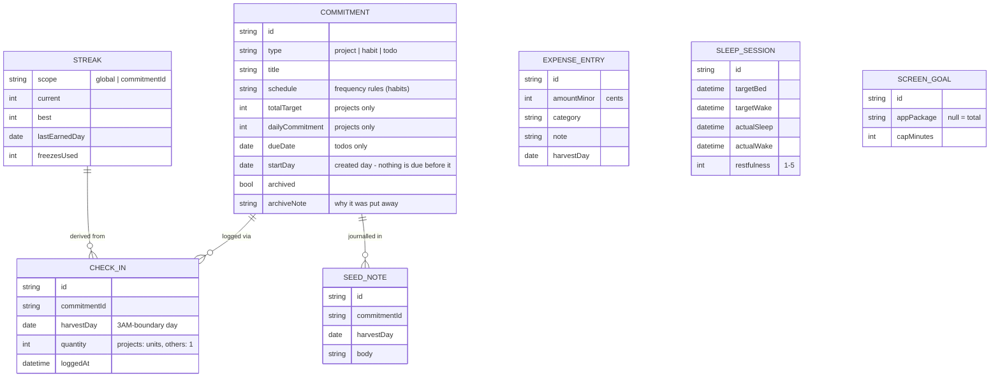

# Core Entities

Six entities cover everything the app tracks. Three belong to the productivity pillar (MVP), three arrive with later phases.

## Seed Note

One note per seed per Harvest Day ([[Checkpoint-3]]). Separate from the
seed's standing note: that one says what the seed is, this one says
where I am in it. Today opens blank with yesterday's quoted above it;
the sequence is the seed's own journal. Spec:
[[Productivity-Engine#Day notes Checkpoint-3|Day notes]].

## Project (finite)

A large goal with a fixed total quantity: *"Read Atomic Habits — 305 pages."*
- **Total Target** (e.g., 305 pages) + **Daily Commitment** (e.g., 10 pages/day).
- Progress = completed units ÷ total units.
- Check-in inputs a *quantity* ("read 12 pages"), capped by the over-log rule in [[Business-Rules]].
- End-state: **Completed** at 100%, with a celebration moment.

## Habit (recurring)

An ongoing behavior with a frequency. Supported schedules:
- **Daily**
- **Weekly** on specific days (Mon/Wed/Fri)
- **Custom interval** (every X days)
- **X-times per week** — I pick the days dynamically as the week unfolds
- End-state: perpetual; measured by its individual streak ([[Gamification]]).

## To-Do (one-off)

A single non-repeating task, optionally with a due day. One tap to complete. To-dos are what the [[Productivity-Engine#The daily plan ritual|daily plan ritual]] is mostly about: each evening or morning I set the day's to-dos.

## Sleep Session (Phase 3)

Planned vs. actual sleep window plus a 1–5 restfulness rating; feeds the sleep-debt gauge. Spec: [[Health-and-Gym]].

## Screen Goal (Phase 4)

A daily cap on total usage or a specific app. Spec: [[Screen-Time]].

## Expense Entry (Phase 2)

Amount + preset category + optional note, contributing to the monthly budget. Spec: [[Finances]].

---

Every check-in, log, and cap outcome funnels into one place: the [[Gamification]] engine. Storage details in [[Local-Database]].
