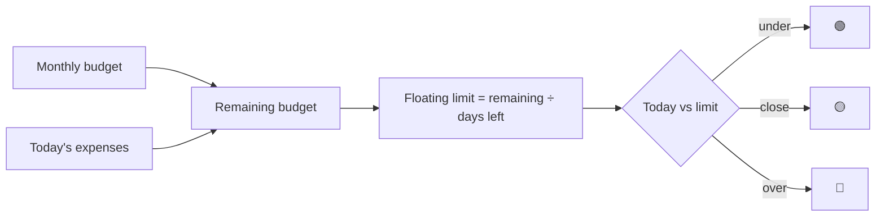

# Financial Granary — Expense Tracking

Phase 2 module ([[Phase-2-Finances]]). Money is a pillar like any other: log it daily, keep the gauge green, earn the XP.

## Layout

The Granary has three tabs: **Today** (gauge, quick-log, today's
entries), **Vault** (wallet, savings, debts, movement history), and
**Insights** (daily bars, category donut, totals, per-day average, and
the range's own ledger).

**Insights reads one span** ([[Checkpoint-4]]): this week, this month,
or any two dates I pick. Whichever it is, the dates are spelled out
under the segments, and the per-day average divides by the days that
have actually elapsed rather than the days in the span.

Every number is on the page, not implied by it: each bar carries its
amount (the peak only, on a range too long to label every bar — and any
bar answers on a tap), and each donut slice reads `38% (DA4,500)`.
Below the charts sit the **moves** the span contains, in the Vault's
own ledger rows.

## The Vault

Three clearly separated sections — **Wallet**, **Savings**, **Debts** —
chosen from three tiles at the top that always show each section's
total (converted into the default currency). The selected section
shows a hero card with its per-currency balances and its actions, then
**Moves**: that section's own atomic transactions, grouped by day.

- **Wallet** — money meant to be spent. Add and take freely; taking
  without logging an expense is allowed.
- **Savings** — money meant to be saved, one pot per currency. Saving
  asks one thing, how much; a **from the wallet** switch inside the
  same sheet decides whether it is a transfer or new money, and it is
  on by default when the wallet can cover it. A withdrawal always
  lands **in the wallet** (spending it is then an ordinary expense),
  and it can't exceed the pot. Total savings (converted) below 10% of
  the monthly budget turns the section red.
- **Moves can be narrowed** ([[Checkpoint-4]]), on the Vault's pots and
  on Insights alike: by **form** (added or taken · transfer · expense ·
  debt payment), by **category**, and by a word searched in the note —
  and in the reference too, so "Sam" finds the debt paid to Sam. The
  three stack; empty means everything, and the collapsed filter carries
  a count so it can never hide rows silently.
- **Every movement is a row** — balances are sums over the signed
  transaction history. Each row carries a **kind** so the ledger
  explains itself: added / taken out / saved / withdrawn (manual),
  from savings / to savings / from the wallet / to the wallet
  (transfer), expense · category, paid *person* (debt).
- Logging an expense carries the same **from the wallet** switch, on by
  default when the wallet can cover it. The wallet withdrawal it creates
  is written in the same transaction and **linked to the expense**:
  editing the amount moves it, deleting the expense refunds it, and Undo
  puts both back. A wallet-funded expense can never leave a ghost
  withdrawal behind.
- **Debts** — an amount owed to someone (no interest), with an optional
  pay-off-by day, a note, and a remind-me-at time. Each open debt shows
  its remaining amount, a paid progress bar, and its **payments** on
  demand; the payment sheet carries the same wallet switch. A payment
  must be positive and no larger than what is still owed, and a settled
  debt refuses further payments. A payment logged by mistake is
  **removed the way an expense is** — long-press it, confirm, undo from
  the snackbar — and removing it takes its wallet movement with it and
  reopens a debt it had settled ([[Audit-v2-Beta]] N-01). Unsettled
  debts nag **daily** (19:00 default) until fully paid; partial
  payments accumulate and full payment settles with a small celebration.
  Settled debts fold into a quiet list underneath.

Amounts are displayed with thousands grouping (`DA36,900,530`) and
always in Latin digits so columns line up in both languages.

The budget sheet sets one thing: the **monthly budget**. The daily
limit is derived (what's left of the month ÷ the days left in it) and
explained there. The **default currency**, the **exchange rates** and
the **custom categories** live together under Settings › Money.

## Quick-log

The whole point is a **sub-5-second log**:
- **Amount** (numeric pad first) — a number, or a sum: `12+3.5*2` shows what it comes to as it is typed, and Log logs the result ([[Checkpoint-6]]). The rule lives once, in `packages/core`, and a fixture both the phone and the web are tested against pins it
- **Logged on** — today unless I say otherwise; a chip takes any day a year either side, for the receipt found in a pocket or the bill I know is coming. The day's +10 follows the day the expense lands on ([[Checkpoint-8]])
- **Category** — preset chips (Food, Transport, Bills, Shopping, Health, Entertainment, Other) plus **custom categories**: create one inline with a name and an icon from the registry; manage (delete) them in the budget sheet
- Optional merchant/note

Stored as integer minor units (cents) — never floats, and always in
the currency the money was in. **Three currencies are supported** —
one default chosen in settings, and any amount logged in another is
converted for the totals at the rate I last fetched, never rewritten
([[Audit-v2]] D3-08). An earlier line here called multi-currency out
of scope; it was out of date the day the Vault shipped.

## Smart repeats

If the same amount+category (e.g., "Coffee — $5, Food") appears 3 days running, day 4 pre-fills it as a 1-tap confirm card.

## Guards on the wallet

- An expense is paid from the wallet only when the wallet can cover it;
  the switch turns itself off rather than let the wallet go below zero.
  Turning it back on in an edit brings back the movement the expense
  already had, not a second one.
- Removing a movement, or undoing that removal, never takes a pot below
  zero; it is refused with the same words as an overdraw.
- The month's total counts the expenses up to today; one logged ahead
  waits for its day.

## Budget logic

- I set a **Monthly Budget**, and can clear it: no budget is an empty value, which every device reads as none.
- **Floating Daily Limit** = remaining budget ÷ remaining days in the month — recomputed at each 3 AM reset ([[Business-Rules]]).
- A real-time gauge: 🟢 under · 🟡 within 15% · 🔴 over.

## Reminders & rewards

- Evening check-in notification (default 8 PM, configurable), suppressed once logged ([[Notifications]]).
- +10 XP for logging the day's expenses. Budget quests are parked with
  the rest of the quest system ([[Gamification]], [[Audit-v2]] D3-08).

## Privacy — non-negotiable

Financial data **never leaves the device** in plaintext. Local-only
through Phase 5; from [[Phase-6-Sync-Accounts-and-Web]] it syncs in
the **private tier** — encrypted on the phone with a passphrase the
server never sees ([[Sync-Strategy]]) — or stays local by choice.
Never sold, never shared. See [[Business-Rules]].
