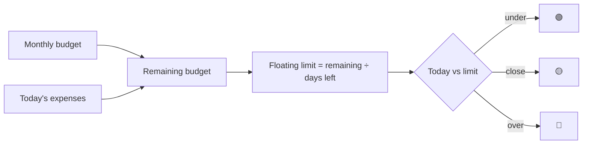

# Financial Granary — Expense Tracking

Phase 2 module ([[Phase-2-Finances]]). Money is a pillar like any other: log it daily, keep the gauge green, earn the XP.

## Layout

The Granary has two tabs: **Today** (gauge, savings pot, quick-log,
today's entries) and **Insights** (daily bar chart + category donut,
switchable between week and month, with totals and per-day average).

## Savings & expectations

- A **savings pot** — a manually-kept number, edited with the budget.
  It turns red when it drops below 10% of the monthly budget.
- An **expected daily spend** for comparing intent against the computed
  floating limit.

## Quick-log

The whole point is a **sub-5-second log**:
- **Amount** (numeric pad first)
- **Category** — preset chips (Food, Transport, Bills, Shopping, Health, Entertainment, Other) plus **custom categories**: create one inline with a name and an icon from the registry; manage (delete) them in the budget sheet
- Optional merchant/note

Stored as integer minor units (cents) — never floats. Multi-currency is out of scope for V1; a single currency is chosen in settings.

## Smart repeats

If the same amount+category (e.g., "Coffee — $5, Food") appears 3 days running, day 4 pre-fills it as a 1-tap confirm card.

## Budget logic

- I set a **Monthly Budget**.
- **Floating Daily Limit** = remaining budget ÷ remaining days in the month — recomputed at each 3 AM reset ([[Business-Rules]]).
- A real-time gauge: 🟢 under · 🟡 within 15% · 🔴 over.

## Reminders & rewards

- Evening check-in notification (default 8 PM, configurable), suppressed once logged ([[Notifications]]).
- +10 XP for logging the day's expenses; budget-related daily quests ([[Gamification]]).

## Privacy — non-negotiable

Financial data **never leaves the device** in plaintext. Local-only in Phases 2–4; when [[Phase-5-Sync-and-Social]] arrives, expense records sync end-to-end encrypted or stay local by choice. Never sold, never shared. See [[Business-Rules]].
