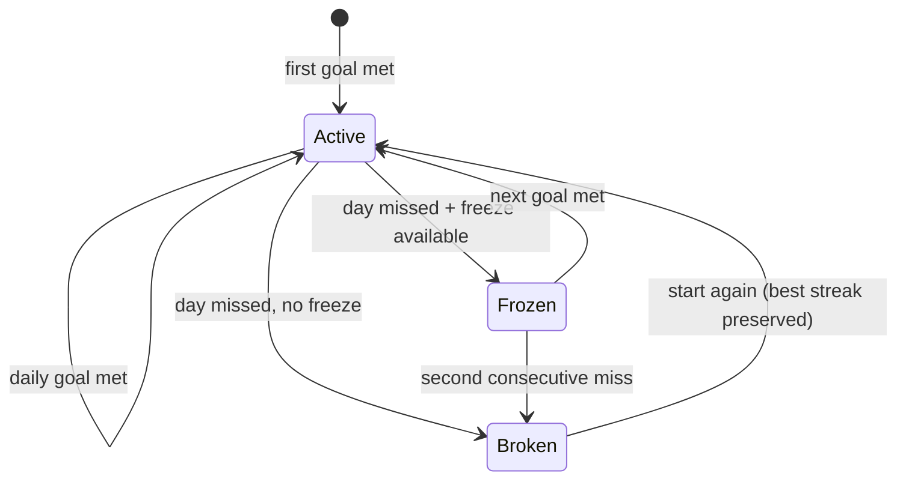

# Gamification & Rewards

The Duolingo core — one engine fed by every pillar.

## Streaks (the heartbeat)

- **Global Streak:** consecutive Harvest Days on which I met my **Daily Harvest Goal** (minimum productive actions, set in [[Onboarding]]).
- **Individual streaks:** each Habit and Project tracks its own.
- **Streak Freeze:** spend Harvest Coins to shield the Global Streak for one missed day. Max 2 stored at a time. Applied automatically at the 3 AM reset if the day was missed.

## XP & Farmer Ranks

| Action | XP |
| :--- | ---: |
| Habit or To-Do checked off | +10 |
| Project unit logged (per unit) | +2 |
| Sleep session logged | +15 |
| Screen time kept under cap | +20 |
| Daily expenses logged | +10 |
| Pomodoro session completed | +5 |

Every **1,000 XP** raises my Farmer Rank: **Sprout → Seedling → Gardener → Harvester → Master Farmer**. XP is lifetime-cumulative and never lost.

## Harvest Coins

Earned from check-ins, streak milestones (7/30/100 days), and rank-ups. Spent on:
- **Streak Freezes**
- Premium **themes**
- Cosmetic **Scarecrow skins** for the home-screen avatar

Coins can never be bought with money in V1 — they're proof of work, not a wallet.

## Dynamic Daily Quests

Each Harvest Day generates 4 micro-quests from a rules pool, biased toward pillars I've been neglecting. Examples:

1. *"Complete 2 habits before 9 AM."* → 20 coins
2. *"Log your expenses before 8 PM."* → 25 XP
3. *"Keep total screen time under 3 hours."* → 30 coins
4. *"Sleep within 15 minutes of your target bedtime."* → 50 XP

Quests referencing a pillar I haven't enabled yet (pre-Phase-2/3/4) never appear.

## Anti-burnout guardrails

Gamification pushes forward but must never trap ([[Vision]]):
- The over-log cap ([[Business-Rules]]) stops binge-grinding.
- Vacation mode pauses a habit without breaking its streak.
- Quests are bonuses — skipping them costs nothing.

Related: [[Productivity-Engine]] · [[Notifications]] · [[Onboarding]]
