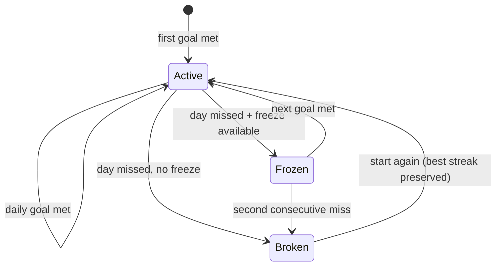

# Gamification & Rewards

The Duolingo core — one engine fed by every pillar.

## Streaks (the heartbeat)

- **Global Streak:** consecutive Harvest Days on which I met my **Daily Harvest Goal** (minimum productive actions, set in [[Onboarding]]).
- **Individual streaks:** each Habit and Project tracks its own — and, from Phase 3, each scheduled photo album ([[Gallery]]).
- **Streak Freeze:** spend Harvest Coins to shield the Global Streak for one missed day. Max 2 stored at a time. Applied automatically at the 3 AM reset if the day was missed.

The activity grid on [[Dashboard-and-Widgets|Stats]] shows the streak
rather than merely implying it ([[Checkpoint-4]]): the days **in the
current run** are solid green — ten days of streak, ten green squares —
while days that had activity outside the run keep a fainter shade, and
quiet days stay grey. The run comes from the streak row's own
`lastEarnedDay` and `current`, so **days a freeze covered are in it**,
which deriving it from activity would have dropped.

## XP & Farmer Ranks

| Action | XP |
| :--- | ---: |
| Habit or To-Do checked off | +10 |
| Memory added to a scheduled album | +10 |
| Project unit logged (per unit) | +2 |
| Sleep session logged | +15 |
| Gym session finished | +10 |
| Body weight logged (once a day) | +5 |
| Step goal met, when a goal is set | +5 |
| Screen time kept under cap | +20 |
| Daily expenses logged | +10 |
| Pomodoro session completed | +5 |

A gym session earns what a habit earns — **+10, once** — however heavy
the day was: going is one productive action, and paying by the set
would turn a training log into a slot machine. It is paid on
**finishing**: starting is an intention and abandoning is a Tuesday
([[Gym]] Y4). A program bound to a habit goes through the same
check-in door as everything else, so a second session the same day
earns nothing and the streak cannot be double-counted.

The weight's +5 and the step goal's +5 are paid through the same
ledger as everything else, one row per day — and were not paid at all
until [[Checkpoint-6]], which is the kind of thing a table of numbers
in a spec cannot tell you.

Sleep is the odd one out at +15, and it is paid for **writing the
night down**, not for sleeping well. The app has no opinion on how
long I slept and every reason to want the number; paying by quality
would make the honest answer the expensive one. Steps are worth less
than a habit on purpose: the phone did the counting, and taking full
credit for a number I did not choose to log would be a lie
([[Health]] H3).

Every **1,000 XP** raises my Farmer Rank: **Sprout → Seedling → Gardener → Harvester → Master Farmer**. XP is lifetime-cumulative and never lost.

### What counts as activity

One list, asked by everyone ([[Audit-v2-Beta]] B-04): a day is
**active** when any of these has a row on it — a check-in (habits,
to-dos, projects, and a finished gym session, which goes through the
same door), a picture in a **scheduled** album, an expense, a night
written down, a weight, a finished workout. The streak engine uses it
to decide whether a stretch of days was idle; the comeback ladder uses
it to decide whether I have stopped. Steps are not on it: the phone
did the counting. The Daily Harvest Goal is narrower on purpose —
check-ins and scheduled-album pictures — because a goal is about
effort, and writing down what happened is not effort.

## Harvest Coins

Earned from **streak milestones** (7 / 30 / 100 days) and spent on
**streak freezes** — that is the whole economy today, and it is the
whole economy on purpose. Coins for every check-in, coins for a
rank-up, premium themes and scarecrow skins were in the first draft of
this page; none of them is built, and the first draft is not a promise
([[Audit-v2-Beta]] N-02). They come back, if they come back, the way
quests will: with an idea of what makes them worth having.

Coins can never be bought with money — they're proof of work, not a wallet.

## Dynamic Daily Quests — parked ⏸

Daily quests shipped in an early build and were **removed pending a
redesign**: generated micro-quests felt arbitrary rather than
motivating. The `quests` table stays in the schema so any old data
survives, and coins still flow from streak milestones. Quests return
once there's a proper idea of what makes them worth doing.

## Anti-burnout guardrails

Gamification pushes forward but must never trap ([[Vision]]):
- The over-log cap ([[Business-Rules]]) stops binge-grinding.
- Vacation mode pauses a habit without breaking its streak.
- Quests are bonuses — skipping them costs nothing.

Related: [[Productivity-Engine]] · [[Notifications]] · [[Onboarding]]
