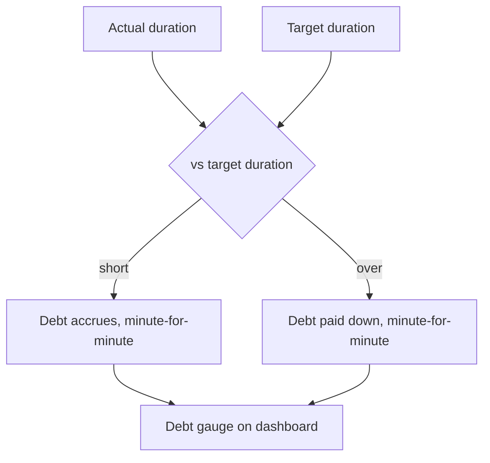

# Health — Sleep Sanctuary & Gym

Phase 3 module ([[Phase-3-Health-and-Gym]]). Two halves: rest (soil health) and training.

## Sleep Sanctuary

### Targets & alarm
- I set a **Target Bedtime** and **Target Wake Time** — fully mine to choose, and they can differ per day of the week (weekend lie-ins are legitimate farming).
- A **gradual-volume alarm** rings at the target wake time (exact alarm scheduling — [[Notifications-and-Background]]).

### Morning retrospective
Dismissing the alarm opens a full-screen card:
1. *When did I actually fall asleep?* — slider
2. *When did I actually wake?* — pre-filled with dismissal time, adjustable
3. *How rested?* — 1–5 stars

Logging earns +15 XP ([[Gamification]]).

### Sleep debt

Debt is displayed prominently but framed as soil health to restore, never as failure.

## Gym & Training

- **Workout plans:** named routines (Push/Pull/Legs, Full-body A/B…) — each a list of exercises with target sets × reps or duration.
- **Sessions:** starting a workout walks through the plan; I log actual sets/reps/weight per exercise. Simple, fast, offline.
- **Scheduling:** a plan binds to a Habit schedule ("Gym — Mon/Wed/Fri"), so completing a session checks in the habit and feeds its streak automatically ([[Productivity-Engine]]).
- **Progress:** per-exercise history (best set, volume over time) in [[Dashboard-and-Widgets]] stats.

Body metrics (weight, measurements) are a lightweight optional log — one number a day, charted. Anything deeper (nutrition, calories) is explicitly out of scope for V1.
