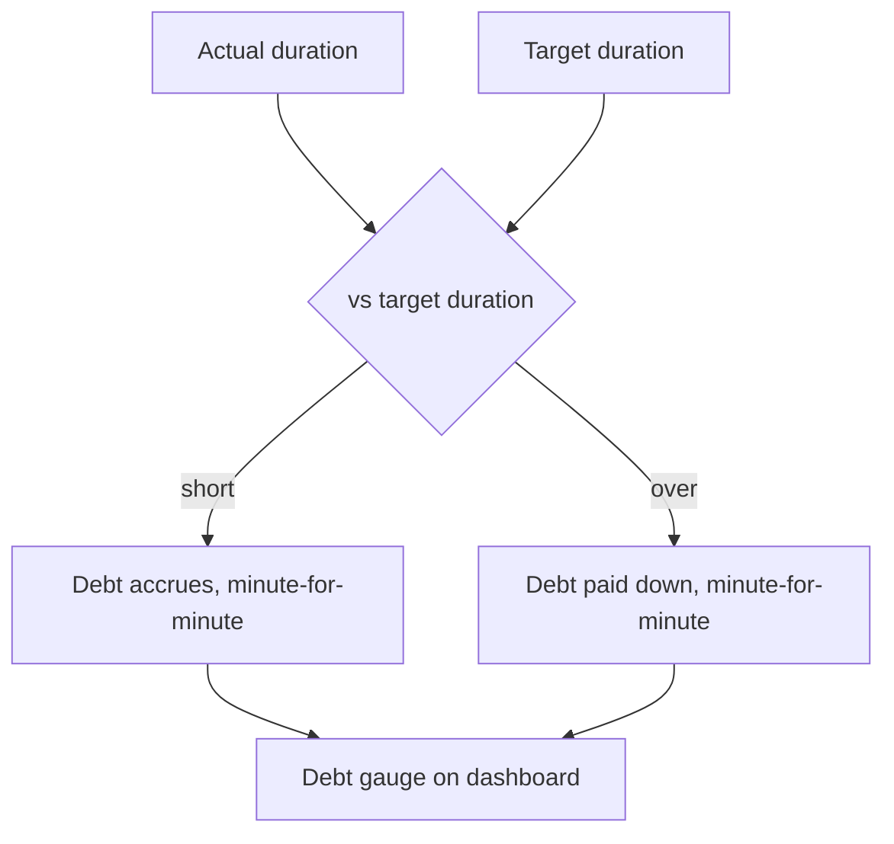

# Health

Phase 4 module ([[Phase-4-Health-and-Gym]]). Three things the body does
whether or not I log them: **sleep**, **steps**, and **weight**.
Training is next door in [[Gym]].

The theme is one the rest of the app already has: a number, taken
honestly, over enough days to have a shape. None of this is a target to
hit every day. All of it is a line to look at.

---

## Sleep Sanctuary

### Targets & alarm
- I set a **Target Bedtime** and **Target Wake Time** — fully mine to
  choose, and they can differ per day of the week (weekend lie-ins are
  legitimate farming). A weekday with no answer of its own uses the
  usual hours; Saturday is not Tuesday and a target that pretends
  otherwise gets ignored.
- An **exact alarm** rings at the target wake time, over the lock
  screen, with alarm-grade audio ([[Notifications-and-Background]]).
  It is off until asked for, and switching it on is where the
  exact-alarm permission is requested — the only moment the answer
  means anything.
- A **wind-down** notification half an hour before the target bedtime,
  on its own switch. A nudge, never an alarm.

Both belong to the sleep switches rather than the general reminders
one: an alarm that the reminders toggle can silence is an alarm
nobody can trust.

These are the same hours the [[Checkpoint-4]] daily cycle already
knows. Sleep does not get a second set of times: it reads the ones the
app already bends the day around.

### Morning retrospective
Three questions, answerable in about eight seconds by someone who is
not yet awake:

1. *When did I actually fall asleep?* — a slider
2. *When did I actually wake?* — a slider
3. *How rested?* — 1–5 stars, and **not answering is an answer**

Both sliders come pre-filled from the night's target, so the honest
path for an ordinary night is: open, tap the stars, done. The alarm's
notification opens the Health screen rather than throwing a full-screen
card at me — the card is at the top with the morning still unwritten,
one tap away. A prompt that fights its way in front of somebody at 7 AM
gets dismissed once and ignored forever.

Logging earns +15 XP, **once** ([[Gamification]]). Going back to fix
a number corrects the record and pays nothing again.

### Sleep debt

Debt is displayed prominently but framed as soil health to restore,
never as failure — a gauge that fills, not a number in red.

Three things the arithmetic settles, and they matter more than the
formula ([[Business-Rules]] #3):

- **The balance floors at zero.** A twelve-hour Sunday clears what is
  owed and does not put me in credit. Sleep is not a bank account, and
  letting one lie-in excuse the week after it would make the gauge a
  liar.
- **An unlogged night counts for nothing**, in either direction. It is
  unknown, not a failure. The one thing this feature must never do is
  punish me for not filling in a form.
- **Each night is judged against the target it had at the time**,
  which is copied into the row when the night is written down. Moving
  my bedtime in March must not rewrite February.

The window is fourteen nights: long enough for a bad run to show,
short enough that a bad month in the spring is not still being held
against me in the summer.

---

## Steps

The one metric in this app I do not have to log, because the phone is
already counting.

### Where the number comes from

Android's own **step counter sensor** (`TYPE_STEP_COUNTER`), read
directly. Not Google Fit, not Health Connect, not an account:

- **No network, no account, no third party.** Reading a sensor keeps
  steps exactly as private as everything else in this app
  ([[Business-Rules]] #6).
- It needs **Activity Recognition** permission, asked when steps are
  switched on and never at first launch — the same manners the
  [[Gallery]] has.
- The sensor counts since boot and resets when the phone reboots, so
  the app stores a **daily total per Harvest Day**, computed from
  deltas, and a reboot mid-day is a gap it closes rather than a day it
  loses.

Where Health Connect is present and the user would rather Harvest read
from it — because a watch is the real source — that is a **later
option, not the default**. The sensor works with nothing installed.

### What it does with it

- A **daily step goal** I set, defaulting to nothing: the number is
  shown before a goal is ever asked for.
- Steps are a **passive number, not a seed.** They do not appear on the
  field, they do not check anything in, and a low-step day is not a
  broken streak. The app did the counting; taking credit for it as a
  productive action would be a lie.
- Once a goal is set, meeting it is worth **+5 XP** — a nod, not a
  habit's +10, because I did not choose to log it.
- History: a bar per day, a weekly average, and a monthly line. Steps
  ride in the archive with everything else.

**Off by default**, with the rest of Health.

---

## Body weight

One number, whenever I stand on the scale. Not a daily obligation.

- **Logged when I weigh myself**, with the time, and more than once a
  day is allowed — morning and evening are different facts.
- Units are mine: **kg or lb**, set once, converted for display and
  never for storage. Weight is stored in **grams**, integer, for the
  same reason money is stored in minor units ([[Business-Rules]] #3):
  a body weight is not a float.
- Optional **note** on any entry — *"after the flu"*, *"new scale"* —
  because the outlier always has a reason and the reason is what makes
  the chart readable a year later.

### The trend is the point

A weight chart of raw daily numbers is noise: water, salt, time of day.
So the chart draws **both**:

- every entry as a light dot, and
- a **7-day moving average** as the line that actually means something.

Above it, one sentence in plain words: *"Down 1.4 kg over 30 days"* —
direction, amount, window. The window is mine to change (30 / 90 days /
all), and the app **never says whether that is good**. It is my body and
my goal; the app's job is the arithmetic.

- An optional **target weight** draws a line, and the summary then adds
  distance to it. No projections, no "you will reach it by" — that is a
  guess dressed as a fact.
- Logging a weight earns **+5 XP**, once a day at most.

### What is not here

No body-fat percentage, no measurements, no photographs — progress
pictures belong to a [[Gallery]] album, where they can be played as a
run and compared side by side. No nutrition, no calories, no macros:
that is a different app and I am not writing it.

---

## Rules

| # | Rule |
| :-- | :--- |
| H1 | Health is off until switched on; permissions are asked at that moment, never at first launch. |
| H2 | Steps come from the phone's own sensor. No account, no network, no third party by default. |
| H3 | Steps are passive: they never check a seed in and never break a streak. |
| H4 | Weight is stored in grams, integer. Units are a display choice. |
| H5 | The weight chart shows the trend, not just the dots — and never judges the direction. |
| H6 | Sleep is written by hand, both ends. Nothing here is measured by the phone, and the +15 XP is paid for writing the night down, not for sleeping well. |
| H7 | Sleep is not a seed: it checks nothing in, breaks no streak, and never appears on the field. |
| H8 | A night is filed under the Harvest Day I **woke up on**, because that is the day it decides. |

Related: [[Gym]] · [[Gallery]] · [[Gamification]] · [[Notifications]] · [[Business-Rules]]
