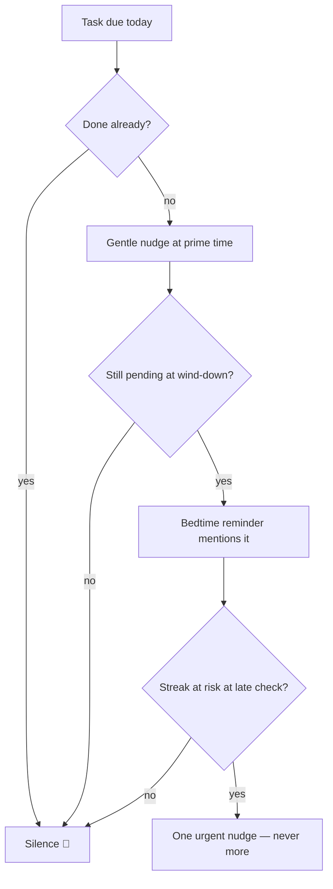

# Notifications & Reminders

Reminders are the product's pulse — but fatigue kills apps. Every notification follows a **gentle-to-urgent** escalation and respects one principle: *never nag about something already done.*

## The daily schedule

Every time below is a **default, not a rule** — each reminder's time is adjustable in Settings, and the wake/bedtime-anchored ones follow whatever targets I set (which can differ per day of the week).

| When | Notification | Condition |
| :--- | :--- | :--- |
| Wake time (default 7 AM) | ☀️ *"Good morning! Here's today's harvest plan."* | Suppressed if I already opened the app |
| Learned prime time −30 min | 🌾 Gentle nudge toward my usual logging window | Only when tasks remain |
| Evening (default 8 PM) | 💰 *"What did you spend today? Log it in 2 taps."* | Phase 2+, suppressed if logged |
| Target bedtime −45 min | 🌙 Wind-down + *"Plan tomorrow's harvest."* | The daily plan ritual hook |
| Late check (default 11 PM) | 🔥 *"Log your remaining tasks to save your 15-day streak!"* | **Only** if the streak is genuinely at risk |
| Real-time | ⏳ Remaining minutes overlay on distracting apps | Phase 4 |

## Prime-time learning

The app records *when* I usually check in and shifts the gentle nudge to 30 minutes before that window. Simple median of the last 14 days' first-check-in times — no cleverness needed.

## Escalation rules

- Hard cap: **max 4 scheduled notifications per day** (excluding the alarm and live timers).
- Every category individually mutable in settings.
- Copy always uses the farming voice ([[Glossary]]) — warm, short, no shame.

Implementation details: [[Notifications-and-Background]].

## Alarms, not toasts (checkpoint round 5)

- A time I set — a seed's *remind me at*, a debt's reminder — **always
  fires**, regardless of the master "Allow reminders" switch; the switch
  only governs the daily rituals (morning, evening, expense, prime time,
  streak risk).
- Every reminder is scheduled **exact to the minute** (Android exact
  alarms; the app asks for the permission the first time a time is set),
  rings on the **alarm stream** with vibration, and shows **over the lock
  screen** for seed and debt reminders.
- Every reminder carries **snooze actions** — *in 10 min · in 1 hour ·
  in 3 hours*. They work with the app closed; the snoozed copy survives
  the daily replan and a reboot.
- Setting or editing a reminder reschedules immediately — no need to
  reopen the app.

