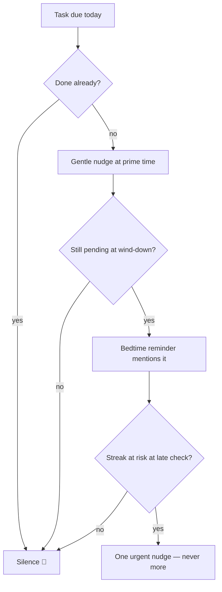

# Notifications & Reminders

Reminders are the product's pulse — but fatigue kills apps. Every notification follows a **gentle-to-urgent** escalation and respects one principle: *never nag about something already done.*

## The daily schedule

Every time below is a **default, not a rule** — each reminder's time is adjustable in Settings, and the wake/bedtime-anchored ones follow whatever targets I set (which can differ per day of the week).

| When | Notification | Condition |
| :--- | :--- | :--- |
| Wake time (default 7 AM) | ☀️ *"Good morning! Here's today's harvest plan."* | Suppressed if I already opened the app |
| Learned prime time −30 min | 🌾 Gentle nudge toward my usual logging window | Only when tasks remain |
| Evening (default 8 PM) | 💰 *"What did you spend today? Log it in 2 taps."* | Phase 2+, suppressed if logged |
| Target bedtime −45 min | 🌙 Wind-down + *"Plan tomorrow's harvest."* | The daily plan ritual hook |
| Late check (default 11 PM) | 🔥 *"Log your remaining tasks to save your 15-day streak!"* | **Only** if the streak is genuinely at risk |
| Real-time | ⏳ Remaining minutes overlay on distracting apps | Phase 4 |

## Prime-time learning

The app records *when* I usually check in and shifts the gentle nudge to 30 minutes before that window. Simple median of the last 14 days' first-check-in times — no cleverness needed.

## Escalation rules

- Hard cap: **max 4 scheduled notifications per day** (excluding the alarm and live timers). A comeback nudge takes the morning ritual's place rather than adding to the count.
- Every category individually mutable in settings.
- Copy always uses the farming voice ([[Glossary]]) — warm, short, no shame.

Implementation details: [[Notifications-and-Background]].

## The daily cycle ([[Checkpoint-4]])

Every default above assumes a shape of day. Settings → **Daily cycle**
makes that shape mine: a bedtime and a wake time, eight hours
recommended, a red warning below five and no refusal — a night shift is
a fact, not a mistake for a dialog to correct.

Changing either time finds every reminder the **new** night would
swallow, seeds and unsettled debts alike, and asks by name before
touching anything. Answering yes moves them by one rule: **a reminder
keeps its distance from waking.** Something set for two hours after I
get up stays two hours after I get up, wrapping past midnight rather
than falling off the end of the day. Only the clashing ones move;
leaving them is a real answer.

The point is to remove an excuse. An app whose reminders only make
sense for someone who rises at seven is quietly telling everyone else
to fix their sleep before they can start — which is the same "I'll
begin on Monday" the whole thing exists to defeat.

## The comeback ladder ([[Checkpoint-3]])

Every other reminder here fires because I asked it to. This one fires
because I **stopped** asking — and for a streak app that is the one
case worth getting right, because an app that goes quiet the moment you
stop opening it has given up on the single thing it does.

Six rungs, escalating from warm to plain, one message each. The ladder
*is* the rotation:

| Rung | Fires | Voice |
| :--- | :--- | :--- |
| 1 day | the morning after one missed day | 🌱 *"Your field is waiting"* |
| 3 days | | *"Three days without water"* |
| 1 week | | 🌾 *"A week away"* |
| 2 weeks | | *"Two weeks quiet"* |
| 1 month | | *"A month of fallow ground"* |
| 2 months | then every 30 days | *"Still here whenever you are"* |

- A rung fires the morning **after** its run of missed days is complete,
  so the one-day nudge lands two days after the last check-in.
- Past the last rung the ladder settles into a **monthly heartbeat**
  rather than going silent. Someone who put the phone down in March
  should still hear from their field in June.
- **Anything counts as showing up**: a check-in or a logged expense
  resets the whole ladder, which is replanned on every check-in, every
  expense, every app open and every 3 AM reset.
- A rung **replaces** the morning ritual on the day it fires rather than
  stacking on it — the 4/day cap is a rule, not a target
  ([[Business-Rules]] #9).
- It is a ritual, so the master "Allow reminders" switch silences it —
  unlike a seed's own reminder, which is a time I asked for.
- It is **not** an alarm: no full-screen intent, no alarm stream, no
  snooze. "We miss you" does not get to wake anybody up.
- No shame, ever. Every message says the history is safe and one
  check-in starts the next streak; none of them counts the days lost.

An app installed and never opened still gets the ladder — with no
check-ins on record it counts from the day the first seed was planted.

## Alarms, not toasts (checkpoint round 5)

- A time I set — a seed's *remind me at*, a debt's reminder — **always
  fires**, regardless of the master "Allow reminders" switch; the switch
  only governs the daily rituals (morning, evening, expense, prime time,
  streak risk).
- Every reminder is scheduled **exact to the minute** (Android exact
  alarms; the app asks for the permission the first time a time is set),
  rings on the **alarm stream** with vibration, and shows **over the lock
  screen** for seed and debt reminders.
- Every reminder carries **snooze actions** — *in 10 min · in 1 hour ·
  in 3 hours*. They work with the app closed; the snoozed copy survives
  the daily replan and a reboot.
- Setting or editing a reminder reschedules immediately — no need to
  reopen the app.

