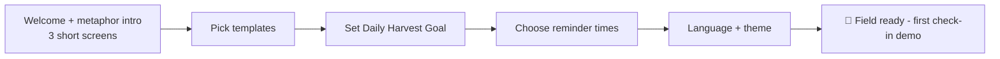

# Onboarding

First-run must get me from install to a planted field in under two minutes.

1. **Welcome:** three swipes introducing seeds/water/harvest ([[Glossary]]). Skippable.
2. **Templates:** pick 3–5 quick-start seeds — *Read More* (project), *Get Fit* (habit), *Learn a Language* (habit), *Fix Sleep* (Phase 3), *Save Money* (Phase 2) — or create custom ones. Templates for not-yet-built phases don't appear.
3. **Daily Harvest Goal:** commit to a minimum number of productive actions per day (default 3) — this defines the Global Streak ([[Gamification]]).
4. **Reminder times:** wake window and bedtime, powering the plan ritual ([[Notifications]]).
5. **Language & theme:** English/Arabic, light/dark/system ([[Localization]], [[Theming-and-Design-System]]).
6. **First check-in demo:** the field appears with the chosen seeds; a guided first tap fires the full haptic + sprite celebration, teaching the core gesture immediately.

No account, no email, no paywall — the app is fully functional offline from second one ([[Sync-Strategy]]).
