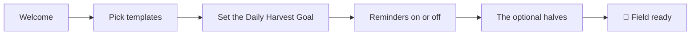

# Onboarding

First-run must get me from install to a planted field in under two minutes.

Five pages, and I can leave at any of them ([[Audit-v2]] D3-07):

1. **Welcome:** seeds, water, harvest ([[Glossary]]).
2. **Templates:** five quick-start seeds — *Read More* (a project),
   *Get Fit*, *Learn a Language*, *Meditate* (three times a week),
   *Journal*. Reading and fitness are ticked to begin with; anything
   else is planted from the field afterwards.
3. **Daily Harvest Goal:** the minimum number of productive actions a
   day (default 3) — this defines the Global Streak
   ([[Gamification]]).
4. **Reminders:** one switch, on by default. The times themselves are
   in Settings, at the defaults in [[Notifications]], because choosing
   four times before using the app once is a decision without
   information.
5. **The optional halves:** five plain questions, all defaulting to
   **no** — [[Notes]], the [[Gallery]], [[Health]], the [[Gym]],
   [[Places]]. None is on unless asked for, all are switchable in
   Settings forever after, and each asks for its permission only when
   it is switched on. Someone who came for a streak tracker should
   reach their field without walking past any of them.

**Language and theme are not a step.** The app takes the phone's
language and theme, and both are one tap away in Settings
([[Localization]], [[Theming-and-Design-System]]). **There is no
guided first check-in**: the field arrives with the chosen seeds and
the first tap teaches itself, celebration and all.

No account, no email, no paywall — the app is fully functional offline from second one ([[Sync-Strategy]]).
