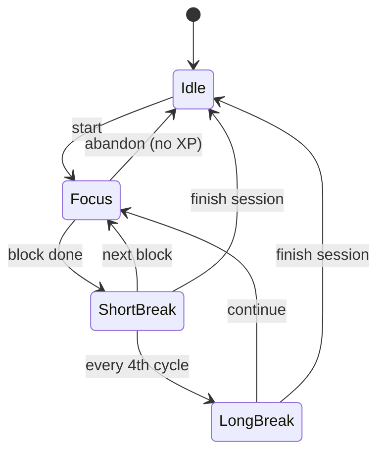

# Pomodoro Timer

A built-in focus tool for effortful commitments — reading, studying, deep work. Ships in the MVP ([[Phase-1-Productivity-Core]]).

## Behavior

- Classic cycle, fully configurable: default **25 min focus / 5 min short break**, long break (15 min) every 4 cycles.
- A session is **attached to a commitment**: I pick the Project/Habit/To-Do it waters. Free-floating sessions are allowed too.
- Finishing a focus block on a Project opens the quantity sheet pre-focused ("How many pages did you get through?"). On a Habit/To-Do it offers the one-tap check-in.
- **+5 XP** per completed focus block ([[Gamification]]).

## States

## Rules

- The timer survives app backgrounding via a persistent notification with live countdown and pause/abandon actions ([[Notifications-and-Background]]).
- Abandoning a focus block early logs nothing — no partial XP, no guilt screen. One gentle line: *"The field will wait."*
- Session history (date, commitment, blocks completed) is stored for stats in [[Dashboard-and-Widgets]].
- Later synergy: during a focus block, Phase 4's [[Screen-Time]] module can optionally auto-block distracting apps.
