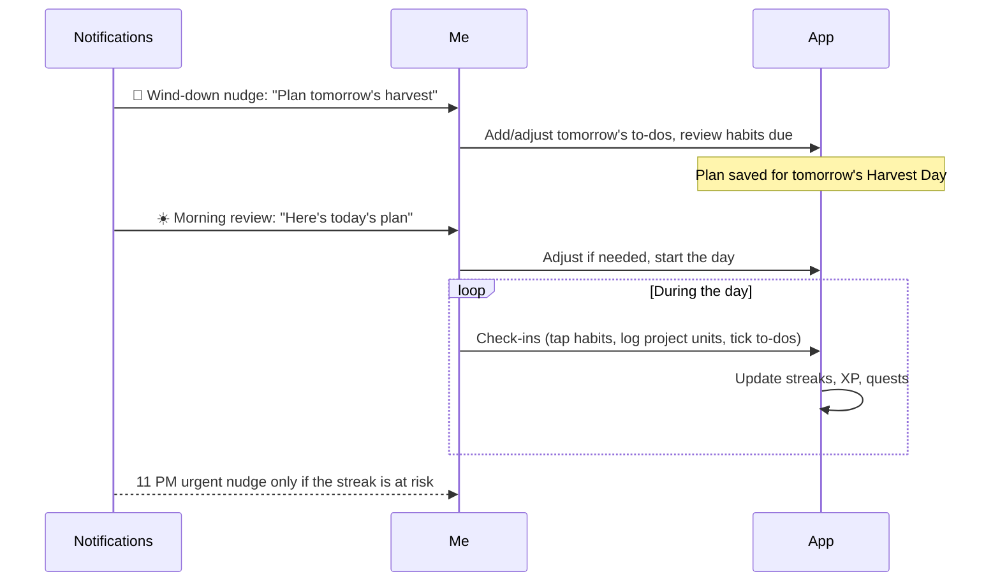

# Productivity Engine

The heart of the MVP: commitments, the daily plan ritual, and check-ins. Everything here lands in [[Phase-1-Productivity-Core]].

## Commitments

"Commitment" is my umbrella term for the three task entities ([[Core-Entities]]):

- **Recurring commitments** — Habits with a schedule, and Projects with a daily commitment. These form the stable backbone of my day.
- **Daily commitments** — To-Dos I set for a specific day during the plan ritual.

## The daily plan ritual

This is the core loop the whole app hangs on. The app reminds me to plan the next day **before I go to sleep**, or catch up **after I wake up**:

If I planned nothing the night before, the morning reminder carries the setup flow instead of the review.

## Check-ins

| Entity | Gesture | Input |
| :--- | :--- | :--- |
| Habit | Single tap | — (done for the day) |
| To-Do | Single tap | — (checked off) |
| Project | Tap → quantity sheet | Units done (pages, minutes, reps) |

- Check-ins can be undone the same Harvest Day (mis-taps happen).
- Project logging is capped at 2× the daily commitment ([[Business-Rules]]).
- A check-in triggers the signature micro-interaction: haptic "thud" + sprite animation ([[Theming-and-Design-System]]).
- Long or focused tasks (reading, studying) can be started as a [[Pomodoro]] session instead; completing the session logs the check-in.

## Editing & lifecycle

- Commitments can be edited, paused (vacation mode for a habit), archived, or deleted.
- Completing a Project (100%) archives it into a "Barn" of finished harvests.
- Deleting never destroys history: check-ins remain for stats and streak integrity.

Related: [[Gamification]] · [[Notifications]] · [[Dashboard-and-Widgets]]
