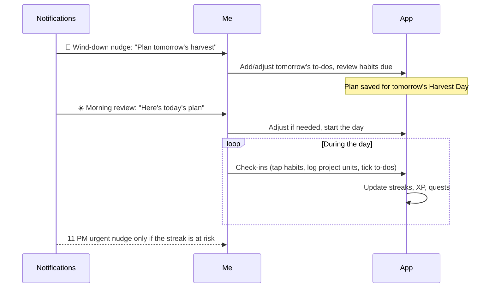

# Productivity Engine

The heart of the MVP: commitments, the daily plan ritual, and check-ins. Everything here lands in [[Phase-1-Productivity-Core]].

## Commitments

"Commitment" is my umbrella term for the three task entities ([[Core-Entities]]):

- **Recurring commitments** — Habits with a schedule, and Projects with a daily commitment. These form the stable backbone of my day.
- **Daily commitments** — To-Dos I set for a specific day during the plan ritual.

## The daily plan ritual

This is the core loop the whole app hangs on. The app reminds me to plan the next day **before I go to sleep**, or catch up **after I wake up**:

If I planned nothing the night before, the morning reminder carries the setup flow instead of the review.

## Check-ins

| Entity | Gesture | Input |
| :--- | :--- | :--- |
| Habit | Single tap | — (done for the day) |
| To-Do | Single tap | — (checked off) |
| Project | Tap → quantity sheet | Units done (pages, minutes, reps) |

- Check-ins can be undone the same Harvest Day (mis-taps happen).
- Project logging is capped at 2× the daily commitment ([[Business-Rules]]).
- A check-in triggers the signature micro-interaction: haptic "thud" + sprite animation ([[Theming-and-Design-System]]).
- Long or focused tasks (reading, studying) can be started as a [[Pomodoro]] session instead; completing the session logs the check-in.

## Advanced options

Every seed can carry, from creation or later editing:
- a **note** — what the seed is about, shown on its card and in the calendar,
- a **remind-me-at** time — a personal nudge fired on days the seed is due, silenced once checked in, and shown on the card as a **live countdown** ("rings in 3h 12m", ticking by the second in the last five minutes; grey and silent once the seed is done),
- an **accomplish-before deadline** (projects and to-dos) — overdue seeds turn urgent-red on the field.

To-dos can be planted on any date, not just today/tomorrow.

## Day notes ([[Checkpoint-3]])

Separate from the standing note above, every seed keeps **one note per
Harvest Day**. The standing note says what the seed *is*; the day note
says where I am in it — the page I stopped on, the weight I lifted,
what to pick up tomorrow.

- Opening the notes sheet shows **today's note**, blank unless I have
  already written one, with **the last note I wrote quoted above it**
  and dated. That quote is the point: *Last time · Sep 3 — stopped on
  page 143*.
- Today's note also appears on the seed's card, so the field itself can
  say where I left off.
- The whole sequence is in the seed's history, and every note is in the
  spreadsheet export ([[Business-Rules]] #11).

## Seed history

Any seed opens onto its own screen — from its options, from a habit row
in Stats, or from the archive. It shows the current and best streak,
the days logged, the units or check-ins, an eight-week strip of the
days I showed up, and a **timeline**: every day the seed was watered or
written about, newest first, with what I logged and what I wrote.

For a seed the streak engine has judged, the streak shown is the stored
one. For everything else — projects, to-dos — it is the honest run of
consecutive days computed from the history itself, because a zero would
be a lie about a month of work.

## Calendar

A month calendar (field app bar) populated from every schedule: habits due per their rules, projects' daily commitments, to-dos on their planned days, and deadline flags. Future days accept quick-planted to-dos.

## Editing & lifecycle

- Commitments can be edited, paused (vacation mode for a habit), archived, or deleted.
- **Nothing is ever due before the day it was planted** — a seed's start day is its creation day, and the calendar's past stays as empty as it really was ([[Business-Rules]] #12).
- **Archiving** is the ordinary way to retire a seed and asks one question: *why?* The answer is stored with it. Archived seeds live on the **Archive** screen, newest first, with the note, the date, and two ways out — restore to the field, or delete.
- **Deleting** is the mistake path, confirmed first and with no undo: it removes the seed, its check-ins, its notes and its streak ([[Business-Rules]] #8). Focus sessions survive it, detached from the seed — the time was still spent.
- Completing a Project (100%) archives it into the Archive of finished harvests.

Related: [[Gamification]] · [[Notifications]] · [[Dashboard-and-Widgets]]
