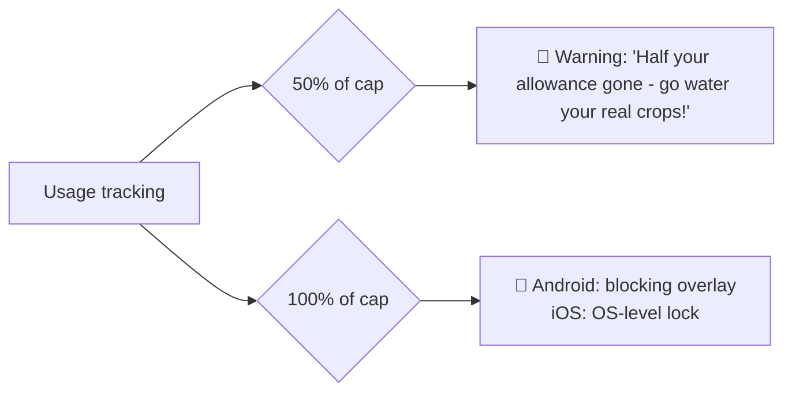

# Focus Field — Screen Time

Phase 4 module ([[Phase-4-Screen-Time]]). The weeds: doomscrolling and app overuse.

## Permissions

- **Android:** Usage Access (`PACKAGE_USAGE_STATS`) + overlay permission for blocking. Requested with a clear explainer screen, only when I enable the module — never at first launch.
- **iOS (later):** Screen Time API via `FamilyControls` + `DeviceActivity` platform channels; enforcement is delegated to the OS.

## Caps

- **Daily Screen Cap** — total device usage (e.g., 3 h/day).
- **Per-app caps** for a chosen list of "distracting apps" (e.g., TikTok ≤ 30 min).

## Weed-pull interventions

- Opening a capped app shows a persistent countdown of remaining minutes.
- Staying under the daily cap earns +20 XP at day close ([[Gamification]]).
- During a [[Pomodoro]] focus block, distracting apps can be optionally auto-blocked.

## Doomscrolling journal

At day's end: *"Was your phone time today well spent?"* — Yes/No. One tap, feeds the weekly report ([[Dashboard-and-Widgets]]).

## Boundaries

Blocking is always **self-imposed and escapable** (a deliberate 5-second "break anyway" hold). Harvest is a tool I control, not a warden — see [[Vision]].
