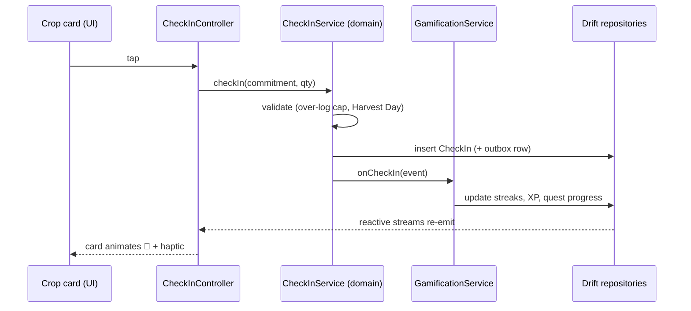

# Architecture Overview

Feature-first, layered, local-first. The goal is a codebase where a feature can be found, read, and changed in one folder, and where the sync layer can be bolted on in Phase 5 without touching domain logic.

## Layers


- **Presentation** knows nothing about storage; it watches Riverpod providers ([[State-Management]]).
- **Domain** is pure Dart — entities and services like the streak engine live here and are unit-testable with zero mocks of Flutter or the DB.
- **Data** implements repository interfaces over Drift ([[Local-Database]]); the future sync client hangs off the same repositories ([[Sync-Strategy]]).
- **Platform** wraps the messy native parts behind thin interfaces ([[Notifications-and-Background]]).

## Package layout

```
lib/
├── app/                  # MaterialApp, router, theme wiring, l10n setup
├── core/                 # shared kernel
│   ├── domain/           #   HarvestDay, value types, Result
│   ├── db/               #   Drift database, migrations
│   ├── platform/         #   notifications, background, haptics wrappers
│   └── ui/               #   design system: tokens, shared widgets
├── features/
│   ├── commitments/      # Phase 1 — habits, projects, todos
│   │   ├── domain/  data/  presentation/
│   ├── gamification/     # Phase 1 — streaks, xp, coins, quests
│   ├── planner/          # Phase 1 — daily plan ritual
│   ├── pomodoro/         # Phase 1
│   ├── finances/         # Phase 2
│   ├── health/           # Phase 3 — sleep + gym
│   ├── screentime/       # Phase 4
│   └── onboarding/
└── main.dart
```

Every feature folder repeats the same `domain/ data/ presentation/` trio. Cross-feature communication goes through domain services (e.g., any check-in calls the gamification service), never by importing another feature's presentation layer.

## Key flows

A check-in, end to end:



Related: [[Business-Rules]] · [[ADR-001-State-Management]] · [[ADR-002-Local-Database]]
