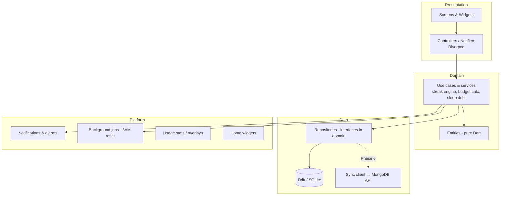
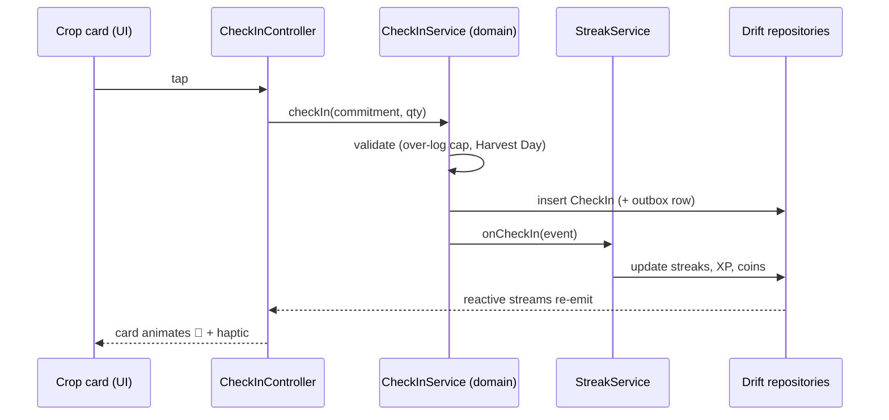

# Architecture Overview

Feature-first, layered, local-first. The goal is a codebase where a feature can be found, read, and changed in one folder, and where the sync layer can be bolted on in Phase 5 without touching domain logic.

## Layers



- **Presentation** knows nothing about storage; it watches Riverpod providers ([[State-Management]]).
- **Domain** is pure Dart — entities and services like the streak engine live here and are unit-testable with zero mocks of Flutter or the DB.
- **Data** implements repository interfaces over Drift ([[Local-Database]]); the future sync client hangs off the same repositories ([[Sync-Strategy]]).
- **Platform** wraps the messy native parts behind thin interfaces ([[Notifications-and-Background]]).

## Package layout

The phone app is `apps/mobile` ([[ADR-009-Monorepo]]):

```
lib/
├── app/                  # MaterialApp, router, theme wiring, l10n setup
├── core/                 # shared kernel
│   ├── domain/           #   HarvestDay, value types, Result
│   ├── db/               #   Drift database, migrations
│   ├── platform/         #   notifications, background, haptics wrappers
│   └── ui/               #   design system: tokens, shared widgets
├── features/
│   ├── commitments/      # Phase 1 — habits, projects, todos
│   │   ├── domain/  data/  presentation/
│   ├── field/            # Phase 1 — today's field, the home screen
│   ├── gamification/     # Phase 1 — streaks, xp, coins
│   ├── planner/          # Phase 1 — daily plan ritual
│   ├── pomodoro/         # Phase 1
│   ├── calendar/         # Phase 1 — the month, and what is due
│   ├── stats/            # Phase 1 — the heat-map and the burn-up
│   ├── farmer/           # Phase 1 — rank, progress, settings' other half
│   ├── settings/         # Phase 1
│   ├── finances/         # Phase 2 — expenses, the vault, the budget
│   ├── notes/            # Phase 3 — notes, links, voice, assist
│   ├── gallery/          # Phase 3 — albums, memories, the timelapse
│   ├── records/          # Phase 3 — the roof over notes, gallery, places
│   ├── health/           # Phase 4 — sleep, steps, weight
│   ├── gym/              # Phase 4 — programs and sessions
│   ├── body/             # Phase 4 — the roof over health and the gym
│   ├── goals/            # Phase 5 — the board and its items
│   ├── places/           # Phase 5 — the trail, geotags, the map
│   ├── assist/           # Phase 5 — the provider behind an assist action
│   ├── sync/             # Phase 6 — the outbox drain and the private tier
│   ├── account/          # Phase 6 — signing in, and what is synced
│   ├── security/         # app lock (checkpoint C2-1)
│   ├── export/           # spreadsheet export (checkpoint C2-2)
│   ├── import/           # the archive, read back
│   ├── widget/           # the home-screen widget
│   └── onboarding/
└── main.dart
```

There is no `screentime/` yet: it is [[Phase-7-Screen-Time]]
([[Audit-v2]] D3-13).

Every feature folder repeats the same `domain/ data/ presentation/` trio. Cross-feature communication goes through domain services (e.g., any check-in calls the gamification service), never by importing another feature's presentation layer.

**Platform edges are interfaces.** Anything that can only answer on a
real device sits behind an abstract interface in `data/`, with the
plugin or method channel as one implementation and a fake in `test/support`:
`NotificationGateway`, `AuthGateway` and `ScreenGuard` (the app lock),
`DownloadsGateway` (the export). The rule earns its keep — the lock's
grace window and the workbook's formulas are both fully tested without a
thumb or a folder.

## Key flows

A check-in, end to end:



Related: [[Business-Rules]] · [[ADR-001-State-Management]] · [[ADR-002-Local-Database]]
