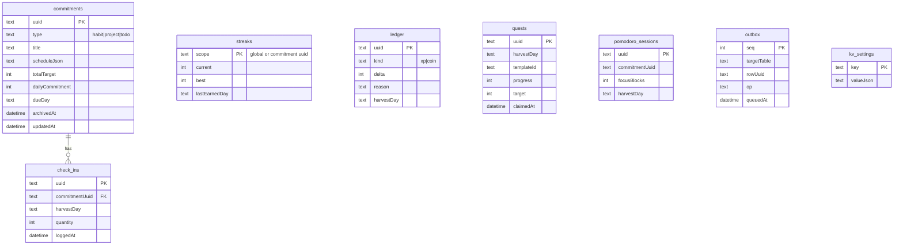

# Local Database — Drift

Decision record: [[ADR-002-Local-Database]]. Drift (SQLite) is the single source of truth on device.

## Principles

- **Money as integers** (minor units), **times as UTC + timezone name**, **Harvest Day as a date column** computed at write time ([[Business-Rules]]).
- **Append-only history:** check-ins, expenses, sleep sessions are never hard-deleted; commitments soft-delete via `archivedAt`.
- **Sync-ready from day one:** every row carries `uuid` (client-generated, the future Mongo `_id`), `updatedAt`, and `deletedAt`; every local write also appends to the `outbox` table ([[Sync-Strategy]]) — the gym's child rows included, since [[Audit-v2-Beta]] Q2-03. Cheap now, priceless later.

## Schema v1 (Phase 1)

XP and coins are a **ledger**, not a counter — balances are sums, history is free, and sync conflicts become trivial merges.

Later phases add tables without touching these: `expenses`, `money_txns`, `debts`, `debt_payments`, `categories` (Phase 2); `notes`, `note_links`, `albums`, `memories` (Phase 3); `sleep_sessions`, `step_days`, `body_weights`, `exercises` (mine only), `programs`, `program_days`, `program_slots`, `target_sets`, `training_maxes`, `workout_sessions`, `workout_sets`, `session_exercises` (Phase 4); `goals`, `goal_items`, `location_points`, `geotags`, `saved_places`, `note_attachments` (Phase 5); `screen_goals`, `usage_days` (Phase 7).

There is **no `budgets` table**: the monthly budget is one setting,
`finance.monthlyBudgetMinor`, because a single number I change a few
times a year is not a table ([[Audit-v2]] D3-02).

Phase 4 landed at **schema v13**; [[Checkpoint-6]] took it to **v14**,
and Phase 5 to **v15**.

**Phase 3 is the first time a row points at a file.** A note's body is
text in the database, but a memory is a path into the app's own
storage. Two consequences worth settling before the code: a memory's
delete is a **hard** delete, because a photo asked to be gone must be
gone; and the archive stops being a spreadsheet, because a photo in a
spreadsheet cell is not an export ([[ADR-007-Archive-Format]]).

`seed_notes` (v9) hangs off `commitments` the way `check_ins` does — one row per seed per Harvest Day, holding what I wrote about it that day ([[Checkpoint-3]]).

`notes` and `note_links` (v10) are the vault. The body is the truth and
the link table is derived from it, rebuildable at any time — which is
what lets an import restore bodies and then reindex rather than
carrying a link table across ([[Notes]] rule N2).

`albums` and `memories` (v10) are the gallery. `memories.path` is
**relative** to the app's gallery directory, so the storage root moving
between installs does not orphan a year of photographs, and an import
can drop the files back under a fresh root and repoint nothing
([[Gallery]] rule G2).

## Migrations

Drift's stepwise migrations, tested with its schema-verification tooling. Every schema change lands with a migration test before merge. Schema history: v6 added `money_txns`, `debts`, `debt_payments`; v7 added `money_txns.kind` + `reference` so each movement records why it happened (manual / transfer / expense / debt) and what it relates to; v8 added `money_txns.link_uuid`, the row a movement belongs to (the expense it paid for, the debt payment it settled) so the two are edited and deleted as one; **v9** added `commitments.archive_note` (why a seed was put away) and the `seed_notes` table; **v10** added the Phase 3 tables — `notes`, `note_links`, `albums` and `memories`; **v11** added `memories.deleted_at`, the gallery's trash ([[Checkpoint-5]]); **v12** and **v13** added the Phase 4 tables, the body in one step and sleep in the next; **v14** added `workout_sessions.paused_at` and `paused_seconds`, the clock that stops for a phone call ([[Checkpoint-6]]); **v15** is Phase 5 in one step — `goals`, `goal_items` and `commitments.goal_uuid` ([[Goals]]), `location_points`, `geotags` and `saved_places` ([[Places]]), and `note_attachments` ([[Notes]] N7); **v16** added `session_exercises.skip_reason`; **v17** added `file_hash` to `memories` and `note_attachments`, the name a file is synced by ([[Sync-API]]); **v18** stores every date as ISO-8601 text, to the microsecond; **v19** added `wishlist_items` ([[Wishlist]]); **v20** added `saved_places.notes` ([[Places]]); **v21** added `expense_categories.created_at`, filled from `updated_at` for the rows I already had, so that the list is ordered by when a category was made and a restored one keeps its place instead of dropping to the end. A column added after v18 is added *before* the v18 rewrite when an upgrade crosses both, because the rewrite rebuilds each table from its current definition.

A seed's **start day** deliberately has no column: `created_at` already
says when it was planted, so the rule that nothing is due before then
([[Business-Rules]] #12) is derived rather than stored, and it is
correct for every row that was already in the database.

**Deleting means deleting, eventually.** Almost every "delete" in the
app is a soft delete: the row keeps its history and its `updated_at` for
a future sync. On each launch, rows soft-deleted more than 30 days ago
are purged for good (`purgeDeleted` on the commitments, finances and
vault repositories). Nothing about money lingers forever by accident.
Notes are not in that sweep: their trash is emptied by hand, from the
trash screen, or a note at a time ([[Notes]], [[Audit-v2]] D3-02).

**What is hard-deleted, and why each one is** ([[Business-Rules]] #8,
[[Audit-v2]] D3-01):

| What | Where | Why not soft |
| :--- | :--- | :--- |
| A seed planted by mistake | `CommitmentsRepository.hardDelete` | Confirmed in the UI first, and it takes its check-ins, notes and streak row in one transaction. A soft delete would skew the stats for thirty days and then be lost anyway. Its focus sessions are detached rather than deleted: the time was still spent. |
| A note emptied from the trash | `NotesRepository.purge`, `emptyTrash` | The trash *is* the soft delete; emptying it is the second confirmation. Links out of the note go with it, and links into it become unresolved rather than pointing at nothing. |
| An album purged | `GalleryRepository.purgeAlbum` | The pictures are files on disk; leaving the rows behind would leave the bytes behind. |
| A note taken off a seed | `SeedNotesRepository.delete` | A line I am editing, not an event. |
| A program's days, slots and target sets | `ProgramsRepository` | The plan is a document I edit; the sessions it produced are the history and are untouched. |
| A set dropped from a session | `SessionsRepository.removeSet` | A set I logged by mistake is not a set I did. |

Every one of them leaves a `delete` row in the outbox, so a sync
carries the removal rather than resurrecting the row.

**Every table is exportable.** The spreadsheet export
([[ADR-006-Export-Format]]) reads each table directly rather than through
the feature repositories, because those filter to what a screen should
show and a backup that quietly drops rows is not a backup. A new table
therefore owes the export a sheet — that is [[Business-Rules]] #11, and
`ExportRepository` is the one place to add it.

**The outbox and privacy.** `money_txns`, `debts`, `debt_payments` and
`expense_categories` append to the same outbox as expenses, and they
carry the most sensitive data in the app — amounts, and other people's
names. They belong in the same tier as expenses in [[Sync-Strategy]]:
end-to-end encrypted, or local-only by choice. The outbox row itself
holds no content, only a table, a uuid and an operation.

## Reference data is not database data (Phase 4)

The exercise catalogue — 1,324 rows of names, muscles and instructions
— ships as a **bundled asset, not a table**
([[ADR-008-Exercise-Catalogue]]). It has no migration, no outbox rows
and no place in the archive, because it is not mine: a logged set
refers to an exercise by its `id` and that is the whole relationship.

Exercises I add myself *are* mine, and those are an ordinary table that
migrates, syncs and exports like everything else.

The same line applies to the animations: fetched, cached in app
storage, and never confused with data. Clearing that cache loses
nothing.
