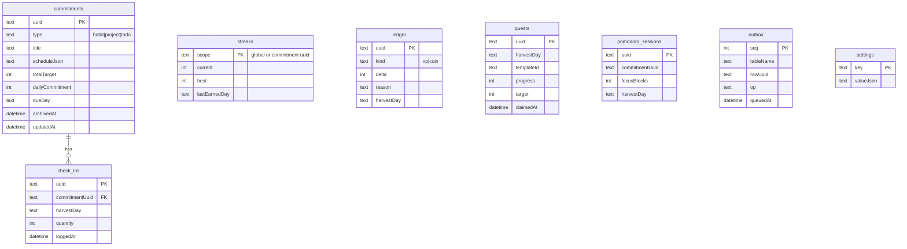

# Local Database — Drift

Decision record: [[ADR-002-Local-Database]]. Drift (SQLite) is the single source of truth on device.

## Principles

- **Money as integers** (minor units), **times as UTC + timezone name**, **Harvest Day as a date column** computed at write time ([[Business-Rules]]).
- **Append-only history:** check-ins, expenses, sleep sessions are never hard-deleted; commitments soft-delete via `archivedAt`.
- **Sync-ready from day one:** every row carries `uuid` (client-generated, the future Mongo `_id`), `updatedAt`, and `deletedAt`; every local write also appends to the `outbox` table ([[Sync-Strategy]]). Cheap now, priceless later.

## Schema v1 (Phase 1)

XP and coins are a **ledger**, not a counter — balances are sums, history is free, and sync conflicts become trivial merges.

Later phases add tables without touching these: `expenses`, `budgets` (Phase 2); `sleep_sessions`, `workout_plans`, `workout_sessions` (Phase 3); `screen_goals`, `usage_days` (Phase 4).

## Migrations

Drift's stepwise migrations, tested with its schema-verification tooling. Every schema change lands with a migration test before merge. Schema history: v6 added `money_txns`, `debts`, `debt_payments`; v7 added `money_txns.kind` + `reference` so each movement records why it happened (manual / transfer / expense / debt) and what it relates to; v8 added `money_txns.link_uuid`, the row a movement belongs to (the expense it paid for, the debt payment it settled) so the two are edited and deleted as one.

**Deleting means deleting, eventually.** Every "delete" in the app is a
soft delete: the row keeps its history and its `updated_at` for a future
sync. On each launch, rows soft-deleted more than 30 days ago are purged
for good (`purgeDeleted` on the commitments, finances and vault
repositories). Nothing about money lingers forever by accident.

**Every table is exportable.** The spreadsheet export
([[ADR-006-Export-Format]]) reads each table directly rather than through
the feature repositories, because those filter to what a screen should
show and a backup that quietly drops rows is not a backup. A new table
therefore owes the export a sheet — that is [[Business-Rules]] #11, and
`ExportRepository` is the one place to add it.

**The outbox and privacy.** `money_txns`, `debts`, `debt_payments` and
`expense_categories` append to the same outbox as expenses, and they
carry the most sensitive data in the app — amounts, and other people's
names. They belong in the same tier as expenses in [[Sync-Strategy]]:
end-to-end encrypted, or local-only by choice. The outbox row itself
holds no content, only a table, a uuid and an operation.
