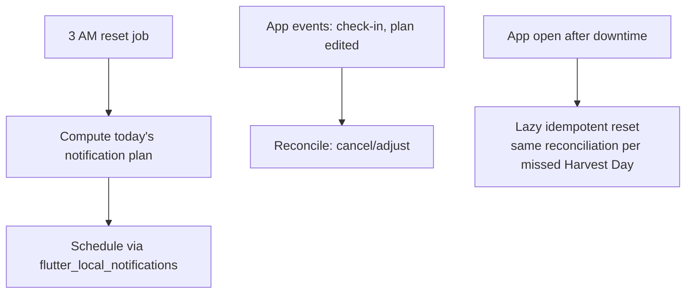

# Notifications & Background Work

The platform layer behind [[Notifications]], the 3 AM reset ([[Business-Rules]]), the [[Pomodoro]] timer, and the Phase 3 alarm.

## Packages

| Concern | Package |
| :--- | :--- |
| Scheduled & shown notifications | `flutter_local_notifications` |
| Periodic/one-off background jobs | `workmanager` (Android) / `BGTaskScheduler` (iOS) |
| Exact wake-time alarm (Phase 3) | `android_alarm_manager_plus` + full-screen intent; iOS critical-alert entitlement or timer-based fallback |
| Timezone-correct scheduling | `timezone` |

## Scheduling model

All of tomorrow's notifications are computed and scheduled **at the 3 AM reset**, then re-scheduled on any relevant change (task completed → cancel its nudge). This keeps the anti-spam rules ([[Notifications]]) enforceable in one place.

## Reliability notes (Android reality)

- The reset job is **idempotent per Harvest Day** — running twice is harmless, and the app runs it lazily on open if the OS skipped it.
- OEM battery killers (Xiaomi, Samsung deep sleep) will drop workmanager jobs; the lazy-on-open fallback is therefore the guarantee, background execution is the optimization.
- Exact alarms need `SCHEDULE_EXACT_ALARM` (Android 12+) — requested only when the sleep alarm feature is enabled in Phase 3.
- Pomodoro keeps time from wall-clock timestamps, not ticking timers, so process death never corrupts a session; the persistent notification is display only.

## Reminder pipeline (round 5)

`NotificationService` (core/platform) schedules with
`exactAllowWhileIdle` when the OS allows it (`USE_EXACT_ALARM` /
`SCHEDULE_EXACT_ALARM` declared, permission requested on first use),
`Importance.max`, the `reminder` category, alarm audio attributes, and
a full-screen intent for seed/debt reminders. The alarm-grade channel is
`reminders_alarm` — Android freezes a channel's settings on creation, so
the old `reminders` channel was retired rather than edited.

Each notification's payload is a `ReminderPayload` (title, body, channel,
route, snooze labels) so it can be repeated. Snooze actions
(`snooze:<minutes>`) run through `reminderBackgroundHandler` — a
`vm:entry-point` in its own isolate that opens the database, records the
snooze in `kv_settings` (`reminders.snoozes`, ids ≥ 5000) and schedules
it; in the foreground the same `SnoozeStore` runs on the app's database.
`NotificationPlanner.planToday` re-applies pending snoozes after its
own cancels, and `RECEIVE_BOOT_COMPLETED` lets the plugin restore alarms
after a reboot.

Every commitment write (`CommitmentEditor`) and every new debt calls the
planner again, so a reminder set now is scheduled now.

**The receivers must be declared by the app.** Since its v18 line the
plugin ships no receivers in its own manifest; without
`ScheduledNotificationReceiver`, `ScheduledNotificationBootReceiver`
(boot + package-replaced) and `ActionBroadcastReceiver` in
`AndroidManifest.xml`, the alarm manager enqueues the broadcast and
Android finishes it with no receiver — nothing is ever shown, and
nothing is logged. That was the silent failure behind every missed
reminder before round 5.

