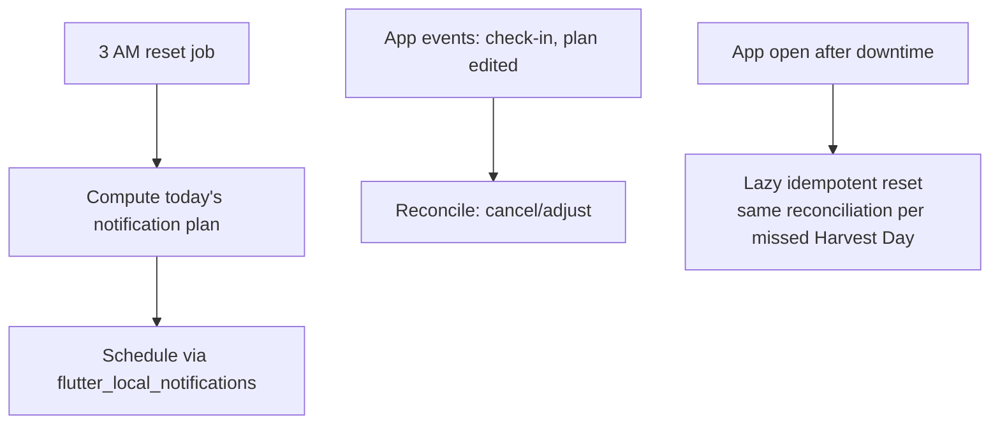

# Notifications & Background Work

The platform layer behind [[Notifications]], the 3 AM reset ([[Business-Rules]]), the [[Pomodoro]] timer, and the Phase 3 alarm.

## Packages

| Concern | Package |
| :--- | :--- |
| Scheduled & shown notifications | `flutter_local_notifications` |
| Periodic/one-off background jobs | `workmanager` (Android) / `BGTaskScheduler` (iOS) |
| Exact wake-time alarm (Phase 3) | `android_alarm_manager_plus` + full-screen intent; iOS critical-alert entitlement or timer-based fallback |
| Timezone-correct scheduling | `timezone` |

## Scheduling model

All of tomorrow's notifications are computed and scheduled **at the 3 AM reset**, then re-scheduled on any relevant change (task completed → cancel its nudge). This keeps the anti-spam rules ([[Notifications]]) enforceable in one place.

## Reliability notes (Android reality)

- The reset job is **idempotent per Harvest Day** — running twice is harmless, and the app runs it lazily on open if the OS skipped it.
- OEM battery killers (Xiaomi, Samsung deep sleep) will drop workmanager jobs; the lazy-on-open fallback is therefore the guarantee, background execution is the optimization.
- Exact alarms need `SCHEDULE_EXACT_ALARM` (Android 12+) — requested only when the sleep alarm feature is enabled in Phase 3.
- Pomodoro keeps time from wall-clock timestamps, not ticking timers, so process death never corrupts a session; the persistent notification is display only.
