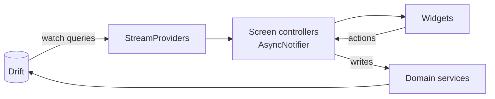

# State Management — Riverpod

Decision record: [[ADR-001-State-Management]]. This note is the *how*.

## Conventions

- **Riverpod with code generation** (`riverpod_generator`): `@riverpod` annotations, no manually-typed provider boilerplate.
- **One controller per screen** (`AsyncNotifier`) owning that screen's action methods; widgets never touch repositories directly.
- **Streams from Drift** are exposed as `StreamProvider`s — the DB is the single source of truth, and UI state is a projection of it. No caches to invalidate by hand.
- **Domain services** (streak engine, quest generator) are plain classes provided via `Provider`; they hold no mutable state of their own.
- `ref.watch` in build, `ref.read` in callbacks — no exceptions.

## Testing

- Domain services: pure Dart unit tests.
- Controllers: `ProviderContainer` with overridden repository providers.
- Golden tests for the design-system widgets in both themes and both text directions ([[Localization]]).
