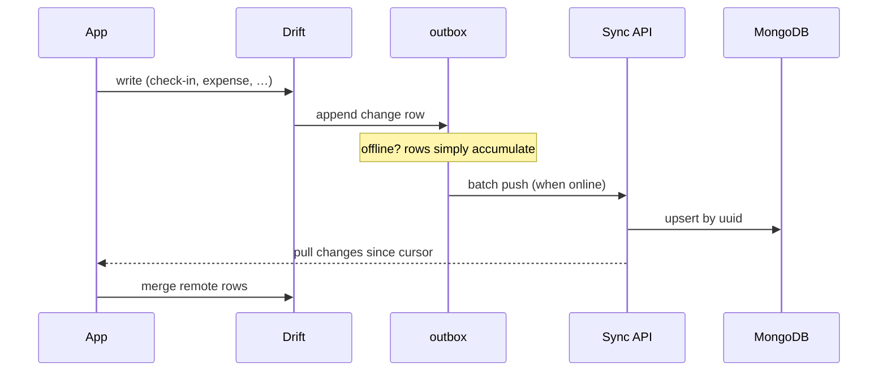

# Sync Strategy — Local-First, Server Later

The rule ([[Business-Rules]] #5): the app is complete without a network. Sync, arriving in [[Phase-6-Sync-and-Social]], adds cross-device convenience and rankings — it never becomes a dependency.

## Why this shape

The server will run **MongoDB**. That does *not* require a document database on the device ([[ADR-002-Local-Database]]): rows already carry client-generated UUIDs (`_id`-ready) and serialize naturally to JSON documents at the API boundary.

## The outbox pattern

Every local write appends an `outbox` row from day one. Phase 5 just adds the drain:

## Conflict policy

- **Ledgers & histories** (check-ins, XP, expenses): append-only → union by UUID, no conflicts possible.
- **Mutable rows** (commitment edits, settings): last-writer-wins on `updatedAt`. With one user across devices, that's honest and sufficient.
- **Derived state** (streaks, balances) never syncs — it's recomputed locally from history.

## Privacy tiers

| Data | Sync behavior |
| :--- | :--- |
| Commitments, check-ins, gamification | Synced plainly (needed for rankings) |
| Expenses | End-to-end encrypted, or local-only by choice |
| Sleep & screen details | Aggregates only (durations), never app-by-app lists |

Rankings/leaderboards consume only the gamification aggregates — total XP, streak length — pseudonymous by design.

## Privacy tiers (audit S-10)

The finance tables — `expenses`, `money_txns`, `debts`, `debt_payments`,
`expense_categories` — sync **end-to-end encrypted or not at all**, my
choice, and `debts` holds third-party names, so it never leaves the
device in plaintext under any setting. Everything else (commitments,
check-ins, streaks, the ledger) syncs under the ordinary account
encryption.

## The spreadsheet is the first half of sync ([[Checkpoint-2]])

Phase 5 is a long way off and until it lands the data has exactly one
home. The **workbook export** is the stopgap that is also the first
step: one `.xlsx` holding every table, which Google Sheets imports with
its formulas live.

The shape is deliberately a contract, not a dump — fixed English sheet
names and headers, money in minor units, ISO-8601 timestamps,
soft-deleted rows carried with their `deletedAt`. See
[[ADR-006-Export-Format]] for why each of those is the way it is.

When sync arrives it writes **these same tabs** into a real Google
Sheet rather than inventing a second shape, and the privacy tiers above
still decide what may leave the device. The export itself is
unencrypted and lands in Downloads: it is a backup I take deliberately,
not a channel, and it is outside the tiers because I am the one moving
it.

