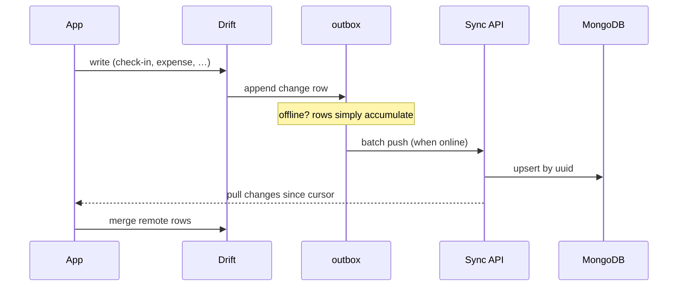

# Sync Strategy — Local-First, Server Later

The rule ([[Business-Rules]] #5): the app is complete without a network. Sync, arriving in [[Phase-5-Sync-and-Social]], adds cross-device convenience and rankings — it never becomes a dependency.

## Why this shape

The server will run **MongoDB**. That does *not* require a document database on the device ([[ADR-002-Local-Database]]): rows already carry client-generated UUIDs (`_id`-ready) and serialize naturally to JSON documents at the API boundary.

## The outbox pattern

Every local write appends an `outbox` row from day one. Phase 5 just adds the drain:

## Conflict policy

- **Ledgers & histories** (check-ins, XP, expenses): append-only → union by UUID, no conflicts possible.
- **Mutable rows** (commitment edits, settings): last-writer-wins on `updatedAt`. With one user across devices, that's honest and sufficient.
- **Derived state** (streaks, balances) never syncs — it's recomputed locally from history.

## Privacy tiers

| Data | Sync behavior |
| :--- | :--- |
| Commitments, check-ins, gamification | Synced plainly (needed for rankings) |
| Expenses | End-to-end encrypted, or local-only by choice |
| Sleep & screen details | Aggregates only (durations), never app-by-app lists |

Rankings/leaderboards consume only the gamification aggregates — total XP, streak length — pseudonymous by design.
