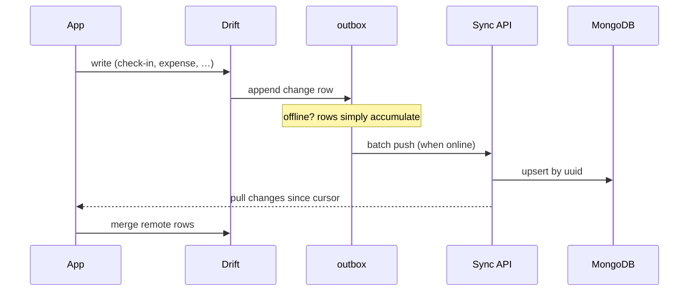

# Sync Strategy — Local-First, Server Later

The rule ([[Business-Rules]] #5): the app is complete without a network. Sync, arriving in [[Phase-6-Sync-Accounts-and-Web]], adds a second device — the web app ([[Web]]) — and later rankings; it never becomes a dependency. The wire contract is [[Sync-API]].

## Why this shape

The server will run **MongoDB**. That does *not* require a document database on the device ([[ADR-002-Local-Database]]): rows already carry client-generated UUIDs (`_id`-ready) and serialize naturally to JSON documents at the API boundary.

## The outbox pattern

Every local write appends an `outbox` row from day one. Phase 6 just adds the drain:

```mermaid
sequenceDiagram
    participant App
    participant DB as Drift
    participant OB as outbox
    participant API as Sync API
    participant M as MongoDB
    App->>DB: write (check-in, expense, …)
    DB->>OB: append change row
    Note over OB: offline? rows simply accumulate
    OB->>API: batch push (when online)
    API->>M: upsert by uuid
    API-->>App: pull changes since cursor
    App->>DB: merge remote rows
```

## Conflict policy

- **Ledgers & histories** (check-ins, XP, expenses): append-only → union by UUID, no conflicts possible.
- **Mutable rows** (commitment edits, settings): last-writer-wins on `updatedAt`. With one user across devices, that's honest and sufficient.
- **Derived state** (streaks, balances) never syncs — it's recomputed locally from history.
- **Clocks only move forward per row.** A local edit of a row last seen with a clock ahead of this device's is stamped just after that clock, so a fast clock elsewhere cannot make my later edit lose. When the server still answers `stale`, its copy wins here too and is pulled back, so no two devices keep different versions ([[Sync-API]]: push).
- **Deletes are tombstones until they are sent.** A pulled purge older than a local edit does not remove the row; a pending local delete made after a pulled copy keeps that copy from coming back; and a row with no clock of its own keeps an edit that has not gone up yet ([[Sync-API]]: pull).

## Privacy tiers

There is one tier now. Since Phase 7 ([[Phase-7-Privacy-and-Currencies]])
**every** synced row and file is end-to-end encrypted, or it does not
leave the device: until then only the finance tables (`expenses`,
`money_txns`, `debts`, `debt_payments`, `expense_categories`) and, from
[[Phase-5-Goals-Places-and-Voice]], the location ones (`location_points`,
`geotags`, `saved_places`) were, and the rest — commitments, check-ins,
notes, gym, body, sleep, settings — went up readable by the server
(audit S-10). Rankings ([[Phase-9-Social-and-Reach]]) will never read my
rows; they will be a number I choose to publish, separately.

The envelope is version 2 ([[Sync-API]]): the key is
made from the sync PIN, the account's salt and a key share the server
keeps outside its database, so a leaked backup alone cannot be used to
try PINs; each row's ciphertext is bound to its table, its key and its
clocks, so the server cannot roll a row back or undelete it by serving
an older ciphertext as newer. A key check stored with the account
decides whether a device chooses the PIN or enters it, and a wrong PIN
is refused before anything is sealed with it ([[Accounts]]).

## The spreadsheet is the first half of sync ([[Checkpoint-2]])

Until sync lands the data has exactly one home. The **workbook export** is the stopgap that is also the first
step: first one `.xlsx` holding every table, and since Phase 3 a zip
archive that carries that workbook beside the notes and pictures
([[ADR-007-Archive-Format]]).

The shape is deliberately a contract, not a dump — fixed English sheet
names and headers, money in minor units, ISO-8601 timestamps,
soft-deleted rows carried with their `deletedAt`. See
[[ADR-006-Export-Format]] for why each of those is the way it is.

When sync arrives it writes **these same tabs** into a real Google
Sheet rather than inventing a second shape, and the privacy tiers above
still decide what may leave the device. The export itself is
unencrypted and lands in Downloads: it is a backup I take deliberately,
not a channel, and it is outside the tiers because I am the one moving
it.

