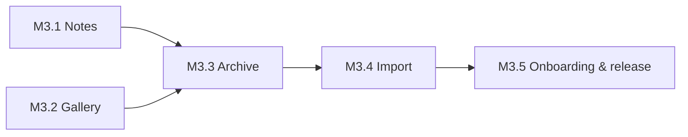

# Phase 3 — Notes, Gallery & the Archive

Specs: [[Notes]] · [[Gallery]] · [[ADR-007-Archive-Format]]

The first phase after v1.0, and it jumps the queue ahead of gym, screen
time and sync. Two features and one long-overdue fix.

**Why first.** [[Phase-4-Health-and-Gym]] and
[[Phase-5-Screen-Time]] both add *more measurement* to an app that
already measures a lot. These two add the thing measurement cannot
reach — what I wrote and what I looked like — and they do it while the
data set is still small enough that the archive rewrite is cheap. Doing
this after two more phases of tables would mean rewriting the export
against twice the surface.

**Why together.** [[Notes]] and [[Gallery]] are separate features that
break the export in the same way: both are *files*, and the export is a
spreadsheet. Fixing that once, for both, is one job; fixing it twice is
two.

## The shape of the phase

## M3.1 — Notes
- [x] Schema: `notes` (uuid, title, folder, body, timestamps, `deletedAt`) and `note_links` (from, to-title, resolved uuid) — both outbox-wired like everything else
- [x] Repository + a `NotesService` that keeps the link index in step with the body on every write
- [x] The list: folders, search across title and body, sort by edited / created / title
- [x] The editor: plain text, autosave debounced, no Save button
- [x] The reader: markdown rendered — headings, emphasis, lists, task lists, quotes, code, links, `[[wiki links]]`
- [x] A `[[link]]` to a note that does not exist is offered as *create it*, not shown as an error
- [x] Backlinks: "what links here", as a list
- [x] The feature switch, off by default, in Settings; the tab appears and disappears with it
- [x] Tests: the link index against edited bodies, unresolved links, rename propagation, the search

## M3.2 — Gallery
- [x] Schema: `albums` (uuid, name, `scheduleJson`, `remindAt`, timestamps) and `memories` (uuid, album, `harvestDay`, path, kind, note, timestamps)
- [x] Capture and import: camera, and picking from the system gallery
- [x] Downscale-on-import for images; a duration cap for video; files in the app's own storage
- [x] Album view: grid, newest first, day on each; per-album storage shown
- [x] **Play**: the album as a timelapse, one frame per memory, speed picked
- [x] **Compare**: two memories side by side, first-and-latest by default
- [x] Notes on a memory, and search across them
- [x] **A scheduled album is a seed**: due on the field, checked in by adding a memory, feeding the streak and the XP ledger through the existing `CheckInService` rather than beside it
- [x] The crop card for an album opens the camera instead of a quantity sheet
- [x] Permissions requested when the feature is switched on, never at first launch
- [x] Deleting a memory deletes the file
- [x] The feature switch, off by default, in Settings
- [x] Tests: the album-as-seed due rule, check-in through an added memory, the downscale, deletion actually deleting

## M3.3 — The archive becomes a zip
- [x] `harvest.xlsx` unchanged inside the zip, plus `Notes` and `Memories` sheets ([[ADR-007-Archive-Format]])
- [x] `notes/` written as an Obsidian-shaped vault; `gallery/<album>/` written as folders of files
- [x] Safe filenames, with the real title kept in the sheet
- [x] Progress reported and the export cancellable — this is now a slow operation and must not look like a hang
- [x] Tests: the tree's shape, the round trip of an awkward title, a memory row pointing at the file that is actually there

## M3.4 — Import
- [x] Read a Harvest zip: validate, then **preview** — how many rows and files, how many new, how many updates
- [x] Merge by uuid: newer wins, absent rows are added, **nothing local is deleted for being missing**
- [x] Files restored into app storage, rows repointed at them
- [x] A failure part-way leaves the database as it was: one transaction per table, and the files land before the rows that point at them (a failure can strand an unreferenced file, never a row pointing at a missing picture)
- [x] Tests: merge against a newer local row, against an older one, a corrupt zip, a zip from a future schema version

## M3.5 — Onboarding, settings and release
- [x] Two questions in [[Onboarding]] — notes, gallery — both defaulting to no
- [x] Both switches in Settings, with what turning off does and does not do said plainly
- [x] Docs updated: the specs, [[Business-Rules]] #11, [[Core-Entities]], [[Local-Database]]
- [ ] `v1.1.0` tagged and installed

**Exit:** I write in it without reaching for another app, there is a
month of daily photos I can play as a run, and I have taken an archive
off this phone and put it back on a fresh install.

## What the build taught me

**The archive needed a third sheet.** [[ADR-007-Archive-Format]] said
`Notes` and `Memories`; it also needs `Albums`. A folder of pictures
cannot carry a schedule, and an album that comes back without its
schedule is a shoebox rather than a seed — which would have quietly
broken rule G3 on every restore. The ADR now says three.

**"Newer wins" needs a real clock.** Timestamps land in the database at
second resolution, so a row written and edited inside the same second
reads as *not newer* on the way back in. That is the right conservative
answer — an archive taken from this phone and put straight back is a
no-op, which is exactly what rule 5 wants — but it is worth knowing
that the merge compares seconds, not microseconds.

**The camera needs no permission.** Rule G1 imagined a prompt when the
feature is switched on. In practice the system camera app takes the
picture through an intent and the system photo picker hands files over,
so there is nothing to ask for. Better than the rule: the feature can
be turned on without a single dialog.

**Six tabs is the ceiling.** With both extras on, the bar carries
Field · Notes · Gallery · Granary · Stats · Settings. It fits, but
there is no room for a seventh, and Phase 4 will have to earn its place
somewhere other than the bottom bar.

## Backlog (discovered during the phase)

- The **Tomorrow** card on the field counts commitments only; a
  scheduled album due tomorrow is not in its "1 habit due".
- The widget's task list does not carry scheduled albums either.
- Export progress counts entries, not bytes, so a gallery of a few huge
  videos moves the bar in jumps.
