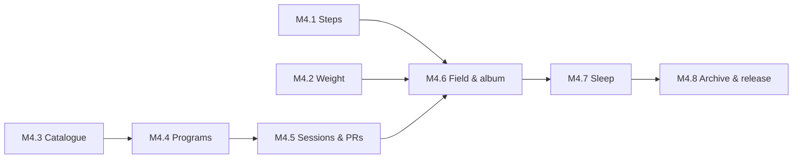

# Phase 4 — Health & the Gym

Specs: [[Health]] · [[Gym]] · [[ADR-008-Exercise-Catalogue]]

The body half. Three passive numbers (sleep, steps, weight) and one
genuinely large feature (training), which is why the gym gets more than
half the milestones.

**Why the gym is the big one.** Every seed so far is checked with a
tap, because "did I do it?" is all a habit needs. Training is the
exception: *what I lifted, and whether it beat last time* is the entire
point, and no tick can hold it. The session screen is the only screen
in this app that has to work one-handed, sweating, between sets — that
constraint drives most of what follows.

Sleep comes late on purpose: it is the one part that needs an
alarm-grade exact-alarm flow, and it is the part I can most easily live
without if the phase runs long.

## M4.1 — Steps
- [x] `TYPE_STEP_COUNTER` behind a platform interface, with a fake for tests ([[Health]] H2)
- [x] Activity Recognition permission asked when Health is switched on, never at launch
- [x] Daily totals per Harvest Day from sensor deltas; a reboot is a gap closed, not a day lost
- [x] Optional daily goal; +5 XP when met, and no goal until one is asked for
- [x] History: bar per day, weekly average, monthly line
- [x] Tests: the reboot case, the 3 AM boundary, a day with no sensor at all

## M4.2 — Body weight
- [x] `body_weights` table: grams (integer), logged-at, optional note
- [x] Log sheet; more than one entry a day is allowed
- [x] kg/lb as a display setting, never a storage one
- [x] Chart: every entry as a dot, a 7-day moving average as the line
- [x] One plain sentence — direction, amount, window — that never judges it
- [x] Optional target weight: a line and a distance, no projection
- [x] Tests: the moving average with gaps, unit conversion round-trip, the summary sentence

## M4.3 — The exercise catalogue
- [x] Trim the dataset to English + the fields Harvest uses; bundle as an asset — **0.8 MB**, better than the 2 MB estimate
- [x] Load into memory once; search by name, body part, equipment, muscle
- [x] Media fetched on demand from the pinned commit, cached in app storage
- [x] `© Gym Visual` attribution wherever media appears ([[ADR-008-Exercise-Catalogue]])
- [x] "Download them all" (says the cost first) and "never fetch" (works completely without)
- [x] Cache size shown and clearable
- [x] My own exercises, stored and exported like my data
- [x] Tests: the trim script's output shape, search, cache hit/miss, the never-fetch path

## M4.4 — Programs
- [x] Schema: `programs`, `program_days`, `program_slots`, `target_sets`, `training_maxes`
- [x] Builder: days, exercise slots in order, target sets, per-exercise rest
- [x] Three kinds of target set: weight × reps, % of training max, open (`1+` / AMRAP)
- [x] Training max per exercise, set and bumped by hand
- [x] Duplicate a day, free-text "recommended accessories" — reordering is still by position only, no drag yet
- [x] Tests: percentage resolution against a training max, rounding to the nearest plate

## M4.5 — Sessions, sets and records
- [x] Session screen: prefilled targets, one tap to accept a set ([[Gym]])
- [x] **Every set written when it is ticked**; an interrupted session resumes (Y3)
- [x] Add a set, drop a set, skip an exercise, replace one on the fly — recorded as such (Y7)
- [x] Rest timer: auto-start on tick, per-exercise duration, and offered even where the program asks for no rest
- [x] Plate calculator for a target weight and bar
- [x] Notes per session and per exercise; session elapsed timer; Finish / discard
- [x] "Last time" on every exercise, always
- [x] PRs: heaviest and best set (Epley e1RM, labelled) — derived, recomputed (Y5, Y6)
- [x] A record announced the moment the set is ticked
- [x] Per-exercise history: every session that logged it, its sets and its best estimated single
- [x] Tests: resume after a kill, e1RM maths, records recomputed when a tick is taken back, replacement history

## M4.6 — The gym on the field, and in the gallery
- [x] A program binds to a habit schedule; times-per-week works as it does for habits
- [x] **Finish checks the habit in** — once, +10 XP, the same streak (Y4)
- [x] Starting and abandoning checks nothing in
- [x] Creating a gym habit offers an album — one dismissible suggestion
- [x] The album bound to a gym habit is **not** separately scheduled: one card, one seed
- [x] Picture prompt preference: after (default) / before / never, as a card in the flow
- [x] Tests: check-in on finish only, no double-counting with the album, the 3 AM boundary

## M4.7 — Sleep
- [x] Target bedtime/wake read from the [[Checkpoint-4]] daily cycle, per-weekday overrides
- [x] Exact alarm with full-screen intent ([[Notifications-and-Background]]) — **not** gradual-volume, see the backlog
- [x] `SCHEDULE_EXACT_ALARM` / `USE_EXACT_ALARM` permission flow, asked when the alarm is switched on
- [x] Wind-down notification half an hour before target bedtime
- [x] Retrospective: fell-asleep slider, wake time, 1–5 stars, all pre-filled from the cycle
- [x] `sleep_sessions` table; minute-for-minute debt engine ([[Business-Rules]])
- [x] Debt gauge on the Health screen; +15 XP for writing the night down
- [x] Tests: debt arithmetic across a week, a lie-in, a night with no log, the storage round trip

## M4.8 — Archive, settings and release
- [x] New sheets in the workbook — twelve of them, because a program that cannot bring its days and sets is not a program ([[ADR-007-Archive-Format]])
- [x] Import merges them by uuid, on the same terms as everything else
- [x] The Health and Gym switches in Settings and their questions in [[Onboarding]], defaulting to no
- [x] Docs: [[Core-Entities]], [[Local-Database]], [[Gamification]], [[Business-Rules]]
- [x] Migration test to schema v13
- [ ] `v1.2.0` tagged and installed

**Exit:** I run a full training week from the app instead of the one I
use now — programme followed, sets logged between sets, a PR announced
when it happens — and the weight line has enough dots to have a shape.

## Settled

- **Rounding is to 0.25 kg.** A percentage set resolves to whatever it
  resolves to and is then rounded to the nearest quarter-kilo. Fine
  enough for micro-plates and dumbbells, coarse enough that nobody is
  reading `83.7625` off a screen.
- **The bar is chosen, and defaults to 20 kg.** Per exercise, because
  an Olympic bar, an EZ bar and a Smith machine are three different
  numbers — but 20 kg unless told otherwise, which is right nearly
  always.
- **Warm-up sets are out of scope for now.** Every set counts as a set.
  If it becomes annoying it becomes a flag on `workout_sets`, which is
  an additive change, so nothing here forecloses it.

## Still open

- **Supersets.** Common enough to matter, and every data model that
  ignores them regrets it. Pair slots, or leave it to M4.4 order?
- **Health Connect** as an optional step source for people with a
  watch — later, and never the default ([[Health]] H2).

## Backlog (discovered during the phase)

- **A barbell cannot make every 0.25 kg target.** Rounding to a quarter
  kilo is right for dumbbells and machines, but a bar is loaded in
  pairs, so its smallest total step is 0.5 kg. The plate calculator
  reports the shortfall rather than rounding it away; the session
  screen has to show that.
- **Reordering exercises** is stored by position but has no drag
  handle yet.
- **The alarm does not fade in.** It is an exact, full-screen,
  alarm-audio notification, which is the loudest thing the
  notification layer can do — but a notification plays one sound at
  one volume. A ramp needs a foreground service holding an audio
  player, which is a native piece this phase did not take on.
- **A gym seed can still be checked in by hand from the field.** That
  is deliberate for now — I go to gyms without my phone — but it means
  the streak can move without a session, which is worth a decision
  rather than an accident.
- **Best-volume is not a record yet.** The heaviest set and the best
  estimated single are; session volume is worked out and shown but
  nothing announces it.
