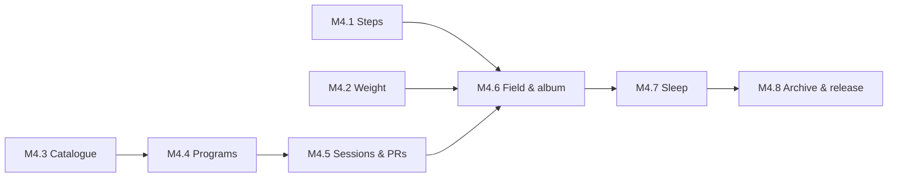

# Phase 4 — Health & the Gym

Specs: [[Health]] · [[Gym]] · [[ADR-008-Exercise-Catalogue]]

The body half. Three passive numbers (sleep, steps, weight) and one
genuinely large feature (training), which is why the gym gets more than
half the milestones.

**Why the gym is the big one.** Every seed so far is checked with a
tap, because "did I do it?" is all a habit needs. Training is the
exception: *what I lifted, and whether it beat last time* is the entire
point, and no tick can hold it. The session screen is the only screen
in this app that has to work one-handed, sweating, between sets — that
constraint drives most of what follows.

Sleep comes late on purpose: it is the one part that needs an
alarm-grade exact-alarm flow, and it is the part I can most easily live
without if the phase runs long.

## M4.1 — Steps
- [ ] `TYPE_STEP_COUNTER` behind a platform interface, with a fake for tests ([[Health]] H2)
- [ ] Activity Recognition permission asked when Health is switched on, never at launch
- [ ] Daily totals per Harvest Day from sensor deltas; a reboot is a gap closed, not a day lost
- [ ] Optional daily goal; +5 XP when met, and no goal until one is asked for
- [ ] History: bar per day, weekly average, monthly line
- [ ] Tests: the reboot case, the 3 AM boundary, a day with no sensor at all

## M4.2 — Body weight
- [ ] `body_weights` table: grams (integer), logged-at, optional note
- [ ] Log sheet; more than one entry a day is allowed
- [ ] kg/lb as a display setting, never a storage one
- [ ] Chart: every entry as a dot, a 7-day moving average as the line
- [ ] One plain sentence — direction, amount, window — that never judges it
- [ ] Optional target weight: a line and a distance, no projection
- [ ] Tests: the moving average with gaps, unit conversion round-trip, the summary sentence

## M4.3 — The exercise catalogue
- [ ] Trim the dataset to English + the fields Harvest uses; bundle as an asset (~2 MB)
- [ ] Load into memory once; search by name, body part, equipment, muscle
- [ ] Media fetched on demand from the pinned commit, cached in app storage
- [ ] `© Gym Visual` attribution wherever media appears ([[ADR-008-Exercise-Catalogue]])
- [ ] "Download them all" (says the cost first) and "never fetch" (works completely without)
- [ ] Cache size shown and clearable
- [ ] My own exercises, stored and exported like my data
- [ ] Tests: the trim script's output shape, search, cache hit/miss, the never-fetch path

## M4.4 — Programs
- [ ] Schema: `programs`, `program_days`, `program_slots`, `target_sets`, `training_maxes`
- [ ] Builder: days, exercise slots in order, target sets, per-exercise rest
- [ ] Three kinds of target set: weight × reps, % of training max, open (`1+` / AMRAP)
- [ ] Training max per exercise, set and bumped by hand
- [ ] Duplicate a day, reorder by drag, free-text "recommended accessories"
- [ ] Tests: percentage resolution against a training max, rounding to the nearest plate

## M4.5 — Sessions, sets and records
- [ ] Session screen: prefilled targets, one tap to accept a set ([[Gym]])
- [ ] **Every set written when it is ticked**; an interrupted session resumes (Y3)
- [ ] Add a set, drop a set, skip an exercise, replace one on the fly — recorded as such (Y7)
- [ ] Rest timer: auto-start on tick, per-exercise duration, runs over the lock screen
- [ ] Plate calculator for a target weight and bar
- [ ] Notes per session and per exercise; session elapsed timer; Finish / discard
- [ ] "Last time" on every exercise, always
- [ ] PRs: heaviest, best set (Epley e1RM, labelled), best volume — derived, recomputed (Y5, Y6)
- [ ] A record announced the moment the set is ticked
- [ ] Per-exercise history: e1RM and volume over time
- [ ] Tests: resume after a kill, e1RM maths, PR recompute after deleting a set, replacement history

## M4.6 — The gym on the field, and in the gallery
- [ ] A program binds to a habit schedule; times-per-week works as it does for habits
- [ ] **Finish checks the habit in** — once, +10 XP, the same streak (Y4)
- [ ] Starting and abandoning checks nothing in
- [ ] Creating a gym habit offers an album — one dismissible suggestion
- [ ] The album bound to a gym habit is **not** separately scheduled: one card, one seed
- [ ] Picture prompt preference: after (default) / before / never, as a card in the flow
- [ ] Tests: check-in on finish only, no double-counting with the album, the 3 AM boundary

## M4.7 — Sleep
- [ ] Target bedtime/wake read from the [[Checkpoint-4]] daily cycle, per-weekday overrides
- [ ] Gradual-volume exact alarm with full-screen intent ([[Notifications-and-Background]])
- [ ] `SCHEDULE_EXACT_ALARM` / `USE_EXACT_ALARM` permission flow
- [ ] Wind-down notification tied to target bedtime
- [ ] Alarm-dismiss retrospective: fell-asleep slider, wake time, 1–5 stars
- [ ] `sleep_sessions` table; minute-for-minute debt engine ([[Business-Rules]])
- [ ] Debt gauge on the Field; +15 XP
- [ ] Tests: debt arithmetic across a week, an alarm dismissed hours late, a night with no log

## M4.8 — Archive, settings and release
- [ ] New sheets in the workbook: `Steps`, `Weights`, `Programs`, `Sessions`, `Sets`, `Sleep` ([[ADR-007-Archive-Format]])
- [ ] Import merges them by uuid, on the same terms as everything else
- [ ] The Health switch in Settings and its question in [[Onboarding]], defaulting to no
- [ ] Docs: [[Core-Entities]], [[Local-Database]], [[Gamification]], [[Business-Rules]]
- [ ] Migration test to the new schema version
- [ ] `v1.2.0` tagged and installed

**Exit:** I run a full training week from the app instead of the one I
use now — programme followed, sets logged between sets, a PR announced
when it happens — and the weight line has enough dots to have a shape.

## Open questions

- **Rounding.** A percentage set resolves to `83.75 kg`, which is not a
  weight anyone loads. Round to the nearest 2.5 kg by default, with the
  increment configurable per exercise? Dumbbells jump in 2 kg, plates
  in 1.25.
- **Bar weight** is per-exercise, not global: an Olympic bar is 20 kg,
  the EZ bar is not, and the Smith machine is a fight.
- **Warm-up sets.** Real programs have them and they should not touch
  PRs or volume. Mark a set as a warm-up, or infer it from the weight?
- **Supersets.** Common enough to matter, and every data model that
  ignores them regrets it. Pair slots, or leave it to M4.4 order?
- **Health Connect** as an optional step source for people with a
  watch — later, and never the default ([[Health]] H2).

## Backlog (discovered during the phase)

*(nothing yet)*
