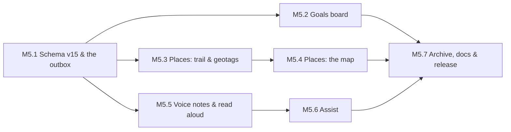

# Phase 5 — Goals, Places & Voice

Specs: [[Goals]] · [[Places]] · [[Notes]] (voice, read aloud, assist) · [[ADR-010-Maps]] · [[ADR-013-Assist-Providers]]

The phone half of the round that began on 2026-09-19. Three features
that change what the app *remembers*, not only what it counts:
- **why** I do things: goals;
- **where** I did them: places;
- **what I said** when typing was too slow: voice.

They go before sync and the web ([[Phase-6-Sync-Accounts-and-Web]])
for one reason: their tables have to exist before the sync contract is
written, or the contract ships without them and is revised on day one.

## M5.1 — Schema v15, and an outbox that is really every write
- [x] One migration, v14 → v15:
  - `goals`, `goal_items`, and `commitments.goal_uuid`;
  - `location_points`, `geotags` and `saved_places`;
  - `note_attachments`.
- [x] Snapshot `drift_schemas/drift_schema_v15.json`; a generated
  migration test from every version.
- [x] [[Audit-v2]] Q3-01 fixed first, because sync reads this table:
  - the ledger, `step_days`, `pomodoro_sessions`, `kv_settings`
    (allow-listed keys only) and the importer all call `logChange`;
  - the ADR's "pruned by a size cap" becomes true.
- [x] `logChange` also writes a pending geotag for an insert into an
  action table while Places is on ([[Places]] PL2). The flag lives on
  the database object and is set by a provider from the setting.

## M5.2 — Goals board
- [x] Repository: goals and items (create, edit, reorder, tick, soft
  delete with undo); achieve/reopen with +50 XP and its mirror row
  (GL4).
- [x] The field gains **Today · Goals** tabs; the board with a progress
  ring, the next step and the seed chips.
- [x] Goal screen: the *why*, **What it takes**, **Steps** and
  **Seeds**; drag to reorder; delete from the item's menu, with undo.
- [x] *Plant* an item → the seed editor, prefilled and linked. The seed
  editor gains **Serves: goal**.
- [x] A planted to-do's check-in ticks its item, and undo un-ticks it
  (GL3), in the check-in service's own transaction.
- [x] Tests: progress, achieve/reopen XP, the tick through check-in and
  undo, GL5 (archive a seed, the goal unchanged).

## M5.3 — Places: the trail and the geotags
- [x] `geolocator` with the Android foreground-service configuration:
  - a permanent notification;
  - a 50 m distance filter, balanced power by default;
  - `FOREGROUND_SERVICE_LOCATION`, `ACCESS_BACKGROUND_LOCATION` and
    `RECEIVE_BOOT_COMPLETED` (resume after reboot).
- [x] Permission flow in two steps (PL1), the feature switch, *pause*
  (1 h, until tomorrow, off).
- [x] `TrailRecorder` writes points; `GeotagFiller` resolves pending
  geotags from the last point, then a fresh fix, else marks them
  unavailable (PL3).
- [x] A `LocationGateway` interface with a fake, the same shape as
  `StepsSource`.
- [x] Tests: the filler's three branches, one geotag per insert into an
  action table and none for updates, bookkeeping or with Places off,
  and the controller's permission and pause rules.

## M5.4 — Places: the map
- [x] `maplibre_gl` with the OpenFreeMap style URL as a setting
  ([[ADR-010-Maps]]), and attribution always visible.
- [x] Records gains **Places** as a third tab.
- [x] Day view: the date strip, the trail line, pins per feature, and
  the timeline sheet (tap a row to fly to it, tap a pin to open it).
- [x] Stays computed from points (PL5); naming a stay saves a place.
- [x] Range view (day, week, month). Clustering and filters by feature
  are still to come: a month of pins is readable without them so far.
- [x] *Delete this day's trail* (undo); *Delete all location history*
  (confirmed).
- [x] Tests: stay detection, a day's trail deleted and restored, the
  paired Records tabs with three halves.

## M5.5 — Voice notes and read aloud
- [x] `record` for AAC/m4a capture, `just_audio` for playback, and
  `note_attachments` rows.
- [x] The embed line `![[name.m4a]]` (N7) stays text, untouched (N5);
  the recordings it names are players under the note, in body order.
- [x] *New voice note* on the Notes app bar (the microphone);
  dictation with `speech_to_text` at the caret, from the toolbar.
- [x] Read aloud with `flutter_tts`: markdown stripped, the voice by
  script, the player sheet with speed.
- [x] Export and archive: recordings beside their `.md`; the importer
  brings them back.
- [x] Tests: the embed parse, the orphaned-recording sweep, the
  markdown-to-speech text.

## M5.6 — Assist
- [x] The `AssistProvider` interface; `GeminiProvider` (streaming, key
  in a header); `OpenAiCompatibleProvider`.
- [x] Settings → Extras → Assist: provider, key (secure storage),
  model, and *Test*.
- [x] Note menu → Assist: six actions, and Transcribe on each
  recording; the sheet names what is sent (N8), then Insert / Replace /
  Copy (N9).
- [x] *Transcribe* on a recording, sending the audio inline to Gemini.
- [x] Tests: the prompt templates, stream parsing for both providers
  against recorded responses, errors shown in plain words.

## M5.7 — Archive, docs, release
- [x] Export sheets `Goals`, `GoalItems`, `LocationPoints`, `Geotags`,
  `SavedPlaces` and `NoteAttachments`; importer descriptors for each;
  [[ADR-006-Export-Format]] and [[ADR-007-Archive-Format]] updated.
- [x] Onboarding's Extras page asks about Places, as it does for Notes
  and the Gym.
- [ ] Specs ticked, checkpoint written, `v2.1.0` tagged with an APK.

**Exit:** a week with the trail on, a goal planted into seeds, and a
voice note transcribed; `v2.1.0`.
