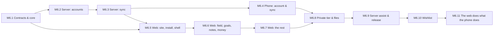

# Phase 6 — Sync, Accounts & the Web

Specs: [[Sync-API]] · [[Accounts]] · [[Web]] · [[Sync-Strategy]] · [[ADR-009-Monorepo]] · [[ADR-011-Backend]] · [[ADR-012-Web-Client]]

Harvest leaves the phone. It comes in four pieces, built in this
order because each one needs the one before it:
1. **The contract**, `packages/contracts`: every synced table and
   every API body as a zod schema.
2. **The server**, `apps/server`: Express 5, TypeScript, MongoDB,
   accounts and the sync API.
3. **The phone's sync client**: an account screen, and the outbox
   finally drained.
4. **The web app**, `apps/web`: React 19, Vite and shadcn/ui,
   local-first in IndexedDB, installable as a PWA, with a public home
   page and the APK download.

It went ahead of screen time on 2026-09-19. A second device for the
data I already have is worth more to me than a cap on the phone.

## M6.1 — Contracts and core
- [x] `packages/contracts`:
  - error shape, auth bodies and account DTOs;
  - the `SyncRecord` envelope, the table registry (name → plaintext or
    private tier → `data` schema), push and pull bodies.
- [x] `packages/contracts/fixtures`: one JSON record per table, parsed
  by the TypeScript tests *and* by a Dart test in `apps/mobile`.
- [x] `packages/core`: `HarvestDay` (3 AM, calendar-safe), `isDueOn`
  with the start-day rule (#12), XP amounts, the over-log cap, goal
  progress, and fixtures shared with Dart for each.

## M6.2 — Server: accounts
- [x] Express 5 app factory with helmet, CORS allow-list, body caps,
  pino, the error middleware and zod-validated routes.
- [x] Mongo repositories (users, sessions, verification and reset
  tokens), with indexes created at boot.
- [x] Register, verify, login, refresh with rotation and family reuse
  detection, logout, forgot/reset, `me`, sessions, delete account
  ([[Accounts]] AC1–AC6).
- [x] Rate limits on auth; the `Mailer` interface (SMTP / log).
- [x] Tests on mongodb-memory-server: every flow, and every negative
  (reuse, expiry, wrong password, unverified sync, a cross-user read).

## M6.3 — Server: sync
- [x] `records` collection keyed `(userId, table, uuid)`; the per-user
  sequence.
- [x] Push (LWW by `updatedAt`, `stale` on a tie, invalid records
  isolated) and pull (by sequence, paged).
- [x] Private-tier envelope checks; purged tombstones.
- [x] `GET /v1/releases/latest`, cached from GitHub.
- [x] Tests: two simulated devices converging; stale edits losing;
  tombstones propagating; one user never seeing another's records.

## M6.4 — Phone: account and sync
- [x] Settings → Account ([[Accounts]]): sign up, sign in, verify
  state, devices, sign out, delete.
- [x] `ApiClient` with refresh-on-401, and tokens in secure storage.
- [x] `SyncService`: pull → push → pull, row serialisers per table
  (checked against the contract fixtures), merge without echoing into
  the outbox, derived state recomputed.
- [x] Triggers: resume, a debounce after writes, every 15 minutes while
  open. The 3 AM job does not sync yet: it runs in its own isolate,
  and the account's tokens would have to follow it there.
- [x] Tests against a fake API: a round trip per table, conflict
  ordering, the cursor, purge.

## M6.5 — Web: the site, the install, the shell
- [x] Vite + React 19 + TypeScript, Tailwind 4 + shadcn/ui themed with
  the Harvest tokens, React Router 7, i18next en/ar with RTL.
- [x] Home, download, privacy; the PWA manifest and service worker;
  the install button (and the iOS steps).
- [x] Login, register, forgot, reset, verify; session in memory with
  the refresh cookie.
- [x] `/app` shell: the rail, the Dexie store, the sync engine (the
  same protocol as the phone), the sync status, settings.
- [x] Tests: vitest + Testing Library for the flows; the sync engine
  against a fake server.

## M6.6 — Web: field, goals, notes, money
- [x] Field: today's seeds, check-in and undo, the over-log cap, the
  day's XP and the streak (`packages/core`). The web keeps the streak
  rows up to date on check-in and undo; judging closed days — freezes,
  breaks — stays with the phone, because two devices judging the same
  day would count it twice.
- [x] Seeds: plant, edit, pause, archive.
- [x] Goals board and goal screen ([[Goals]]).
- [x] Notes: folders, the editor (markdown styled in place), links and
  backlinks, search.
- [x] Expenses: log, edit, move a day, the month and the budget.
- [x] Keyboard shortcuts ([[Web]]).

## M6.7 — Web: the rest
- [x] Vault (the pots and their ledgers, debts), the month's budget
  with its floating daily limit, the calendar, and the run so far —
  the heat-map and each habit's streak — on the farmer.
- [x] Body: sleep, weight and steps, as views.
- [x] Gym: programs and history, with the catalogue's names carried as
  their own index because the catalogue does not sync (#14).
- [x] Places: the day on a MapLibre map, its trail, its pins and its
  stays, loaded only when the map is opened.
- [x] Gallery: what each album holds. The pictures wait for M6.8.

## M6.8 — The private tier, and files
- [x] Sync passphrase: PBKDF2-SHA256 → AES-256-GCM, identical in Dart
  (`cryptography`) and WebCrypto, pinned by `fixtures/crypto.json`, with
  the table and key as additional data so a sealed row cannot be moved.
- [x] Finance and location tables sync encrypted ([[Sync-API]]), checked
  end to end against the real server (`test/e2e`).
- [x] Content-addressed file sync for pictures and recordings,
  encrypted, with size caps: `POST /v1/files/missing` before anything
  is sent, `PUT`/`GET /v1/files/<sha256>`, 25 MB a file and 2 GB an
  account. The phone hashes, seals, uploads and stamps the row; what
  comes back is hashed again before it is written.
- [x] Microsecond clocks on the phone: schema v18 stores dates as
  ISO-8601 text, converted with sqlite's own `datetime(…, 'unixepoch')`
  so every instant is the one that was already there.

## M6.9 — The server assist, and the release
- [x] `POST /v1/assist`: server-held key, per-account daily quota, the
  answer relayed as server-sent events; `GET /v1/assist/status` says
  whether the server offers one at all.
- [x] The prompts moved to `packages/core` with a fixture both clients
  are read against, so the same button asks the same thing.
- [x] `HarvestServerProvider` on the phone — the fallback, since a key
  of my own still wins — and the assist in the web's note editor,
  where the server is the only provider a browser can safely have.
- [x] Deployment notes ([[Deployment]]): the server's two-stage
  image, built and run against a real MongoDB to prove it serves; the
  static web bundle, and the two things its host must do.

## M6.10 — Wishlist ([[Wishlist]])
A fourth Granary tab carrying two lists — **to buy** (day to day) and
**wishlist** (future planning) — with an estimated price, note and
planned purchase day on each item. One `wishlist_items` table, plain
sync, its own export sheet: planned (W1–W7), and shipped on both
clients before the checkpoint.
- [x] Schema: `wishlist_items` (v19), listed in the contract registry
  with a plain fixture, so the phone and the browser agree on columns.
- [x] Phone: repository (add, edit, move, reorder, mark bought, soft
  delete, purge), the tab with its two segments and per-currency
  totals, the editor sheet, `gen-l10n` strings in both languages.
- [x] Web: Dexie store + repository, the panel and editor, the
  Granary's fourth tab opened without the passphrase gate (the money
  tabs keep theirs).
- [x] Wishlist sheet in the workbook: read, write and import, with the
  Summary counting it and the totals leaving estimates out.
- [x] Migration test v18 → v19 and the schema dump; feature, export and
  web tests.
- [x] Saved places take a note (v20), every geotagged action shows
  where it happened ([[Places]] PL8), and the map has a satellite base
  (PL9, [[ADR-010-Maps]]).

## M6.11 — The web does what the phone does
Until here the web read most of the app and wrote a third of it. The
rule from now on: anything the phone writes that does not need the
phone's own hardware, the browser writes too ([[Web]]).
- [x] Field: a seed's own page (the run, the eight weeks, the
  timeline) and its daily notes, the focus timer, tomorrow's plan, the
  project-done moment, the calendar's quick to-do, a freeze bought
  with coins, the weekly report; scheduled albums on the field.
- [x] Granary: wallet and savings moves, debts and their payments, the
  budget set and cleared, categories, sums in an amount (one rule in
  `packages/core`, pinned by a fixture both sides read), the repeat
  card, and the Insights tab.
- [x] Body: nights and weights written, the steps goal and stride; the
  program editor, exercise records and the plate calculator (the gym's
  rules in `packages/core/gym.ts`, with a fixture), and a session run
  in the browser from start to finish.
- [x] Files: pictures and recordings uploaded, sealed, from the
  browser. Gallery: albums with schedules, pictures, the viewer, trash,
  compare and the timelapse. Notes: folders, tables, recordings, read
  aloud, print.
- [x] Places: week and month, a stay named, a place edited or
  forgotten, location history deleted, and opt-in geotags from the
  browser.
- [x] Settings as on the phone (the daily cycle, features, rates, the
  focus lengths), the first run, and the archive exported and imported
  in the phone's format — a web zip imports on the phone and the
  other way round, pinned by two fixtures.
- [x] Deployment: `deploy/compose.yaml` runs the database, the server
  and Caddy serving the site, with the headers in `deploy/Caddyfile`
  ([[Deployment]]).
- [x] The checkpoint ([[Checkpoint-9]]) and `v3.0.0-beta.2`.
- [x] A fourth audit, by hand on both clients ([[Audit-v3-Beta]]), fixed and retested; `v3.0.0-beta.3`.
- [ ] `v3.0.0`, once the beta has been lived in.

**Exit:** the phone and the browser converge on the same day's
field, the same notes and the same month of expenses, with the private
tier unreadable on the server; `v3.0.0`.
