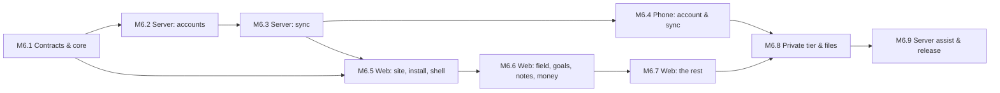

# Phase 6 — Sync, Accounts & the Web

Specs: [[Sync-API]] · [[Accounts]] · [[Web]] · [[Sync-Strategy]] · [[ADR-009-Monorepo]] · [[ADR-011-Backend]] · [[ADR-012-Web-Client]]

Harvest leaves the phone. It comes in four pieces, built in this
order because each one needs the one before it:
1. **The contract**, `packages/contracts`: every synced table and
   every API body as a zod schema.
2. **The server**, `apps/server`: Express 5, TypeScript, MongoDB,
   accounts and the sync API.
3. **The phone's sync client**: an account screen, and the outbox
   finally drained.
4. **The web app**, `apps/web`: React 19, Vite and shadcn/ui,
   local-first in IndexedDB, installable as a PWA, with a public home
   page and the APK download.

It went ahead of screen time on 2026-09-19. A second device for the
data I already have is worth more to me than a cap on the phone.

## M6.1 — Contracts and core
- [ ] `packages/contracts`:
  - error shape, auth bodies and account DTOs;
  - the `SyncRecord` envelope, the table registry (name → plaintext or
    private tier → `data` schema), push and pull bodies.
- [ ] `packages/contracts/fixtures`: one JSON record per table, parsed
  by the TypeScript tests *and* by a Dart test in `apps/mobile`.
- [ ] `packages/core`: `HarvestDay` (3 AM, calendar-safe), `isDueOn`
  with the start-day rule (#12), XP amounts, the over-log cap, goal
  progress, and fixtures shared with Dart for each.

## M6.2 — Server: accounts
- [ ] Express 5 app factory with helmet, CORS allow-list, body caps,
  pino, the error middleware and zod-validated routes.
- [ ] Mongo repositories (users, sessions, verification and reset
  tokens), with indexes created at boot.
- [ ] Register, verify, login, refresh with rotation and family reuse
  detection, logout, forgot/reset, `me`, sessions, delete account
  ([[Accounts]] AC1–AC6).
- [ ] Rate limits on auth; the `Mailer` interface (SMTP / log).
- [ ] Tests on mongodb-memory-server: every flow, and every negative
  (reuse, expiry, wrong password, unverified sync, a cross-user read).

## M6.3 — Server: sync
- [ ] `records` collection keyed `(userId, table, uuid)`; the per-user
  sequence.
- [ ] Push (LWW by `updatedAt`, `stale` on a tie, invalid records
  isolated) and pull (by sequence, paged).
- [ ] Private-tier envelope checks; purged tombstones.
- [ ] `GET /v1/releases/latest`, cached from GitHub.
- [ ] Tests: two simulated devices converging; stale edits losing;
  tombstones propagating; one user never seeing another's records.

## M6.4 — Phone: account and sync
- [ ] Settings → Account ([[Accounts]]): sign up, sign in, verify
  state, devices, sign out, delete.
- [ ] `ApiClient` with refresh-on-401, and tokens in secure storage.
- [ ] `SyncService`: pull → push → pull, row serialisers per table
  (checked against the contract fixtures), merge without echoing into
  the outbox, derived state recomputed.
- [ ] Triggers: resume, a debounce after writes, every 15 minutes while
  open, the 3 AM job.
- [ ] Tests against a fake API: a round trip per table, conflict
  ordering, the cursor, purge.

## M6.5 — Web: the site, the install, the shell
- [ ] Vite + React 19 + TypeScript, Tailwind 4 + shadcn/ui themed with
  the Harvest tokens, React Router 7, i18next en/ar with RTL.
- [ ] Home, download, privacy; the PWA manifest and service worker;
  the install button (and the iOS steps).
- [ ] Login, register, forgot, reset, verify; session in memory with
  the refresh cookie.
- [ ] `/app` shell: the rail, the Dexie store, the sync engine (the
  same protocol as the phone), the sync status, settings.
- [ ] Tests: vitest + Testing Library for the flows; the sync engine
  against a fake server.

## M6.6 — Web: field, goals, notes, money
- [ ] Field: today's seeds, check-in and undo, the over-log cap, the
  day's XP and the streak (`packages/core`).
- [ ] Seeds: plant, edit, pause, archive.
- [ ] Goals board and goal screen ([[Goals]]).
- [ ] Notes: folders, the editor (markdown styled in place), links and
  backlinks, search.
- [ ] Expenses: log, edit, move a day, the month and the budget.
- [ ] Keyboard shortcuts ([[Web]]).

## M6.7 — Web: the rest
- [ ] Vault, calendar, stats, farmer and streak details.
- [ ] Body: sleep, weight and steps, as views.
- [ ] Gym: programs and history.
- [ ] Places: the map, day and range views.

## M6.8 — The private tier, and files
- [ ] Sync passphrase: PBKDF2-SHA256 → AES-256-GCM, identical in Dart
  (`cryptography`) and WebCrypto, pinned by a shared fixture.
- [ ] Finance and location tables sync encrypted ([[Sync-API]]).
- [ ] Content-addressed file sync for pictures and recordings,
  encrypted, with size caps.

## M6.9 — The server assist, and the release
- [ ] `POST /v1/assist`: server-held key, per-user quota, the same
  prompt templates.
- [ ] `HarvestServerProvider` on the phone and the web.
- [ ] Deployment notes (Docker image for the server, the static web
  bundle), then the checkpoint and `v3.0.0`.

**Exit:** the phone and the browser converge on the same day's
field, the same notes and the same month of expenses, with the private
tier unreadable on the server; `v3.0.0`.
