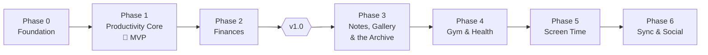

# Roadmap

Phases ship in the order that matches how I'll actually use the app: the streak core first (it *is* the product), then money — and, from v1.0, the things a number cannot hold, before body, attention and the network.

| Phase | Delivers | Exit criterion |
| :--- | :--- | :--- |
| [[Phase-0-Foundation]] | Scaffold, design system, l10n, DB, routing | App shell runs in en/ar, light/dark, with an empty field |
| [[Phase-1-Productivity-Core]] | Commitments, plan ritual, streaks, XP, quests, pomodoro, notifications | **I use it daily instead of any other tracker** — installable MVP |
| [[Phase-2-Finances]] | Expense quick-log, budgets, gauge | A month of spending logged in under 5 s/day |
| **v1.0** | Four checkpoints on top: calendar, vault, app lock, spreadsheet export, notes on seeds, the archive screen, the comeback ladder, the home-screen widget, the daily cycle | **Shipped 2026-09-05** |
| [[Phase-3-Notes-and-Gallery]] | Markdown notes with links, photo albums that are seeds, the zip archive **and an importer** | I write in it, I can play a month of photos as a run, and an archive restores onto a fresh install |
| [[Phase-4-Health-and-Gym]] | Sleep alarm + debt, workout plans & sessions | Alarm replaces my system clock app |
| [[Phase-5-Screen-Time]] | Usage caps, weed-pull interventions (Android) | Caps enforce reliably through a full week |
| [[Phase-6-Sync-and-Social]] | Accounts, MongoDB sync, rankings, iOS polish | Two devices converge; leaderboard live |

**Phase 3 jumped the queue.** Notes and the gallery were not on the
original list at all; they went in front of gym and screen time because
they add what measurement cannot reach, and because they force the
archive rewrite while the data set is still small enough for it to be
cheap ([[Phase-3-Notes-and-Gallery]]).

## Working rules

- Each phase ends with a tagged release I install and live with before starting the next — **dogfooding is the QA department**.
- Milestones inside a phase are sequential; tasks within a milestone are the parallel unit.
- Anything discovered mid-phase goes to the phase backlog section, not into scope.
