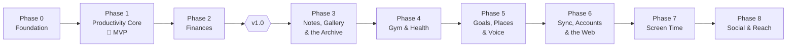

# Roadmap

Phases ship in the order that matches how I'll actually use the app: the streak core first (it *is* the product), then money — and, from v1.0, the things a number cannot hold, before body, attention and the network.

| Phase | Delivers | Exit criterion |
| :--- | :--- | :--- |
| [[Phase-0-Foundation]] | Scaffold, design system, l10n, DB, routing | App shell runs in en/ar, light/dark, with an empty field |
| [[Phase-1-Productivity-Core]] | Commitments, plan ritual, streaks, XP, quests, pomodoro, notifications | **I use it daily instead of any other tracker** — installable MVP |
| [[Phase-2-Finances]] | Expense quick-log, budgets, gauge | A month of spending logged in under 5 s/day |
| **v1.0** | Four checkpoints on top: calendar, vault, app lock, spreadsheet export, notes on seeds, the archive screen, the comeback ladder, the home-screen widget, the daily cycle | **Shipped 2026-09-05** |
| [[Phase-3-Notes-and-Gallery]] | Markdown notes with links, photo albums that are seeds, the zip archive **and an importer** | **Shipped 2026-09-06 as v1.1.0** |
| [[Phase-4-Health-and-Gym]] | Steps, body weight, and a real training log — programs, sessions, personal records — plus the sleep alarm and debt | **Shipped 2026-09-15 as v2.0.0**, after four betas: [[Checkpoint-6]], the [[Audit-v2-Beta]], [[Checkpoint-7]] and [[Checkpoint-8]] |
| [[Phase-5-Goals-Places-and-Voice]] | A goals board on the field, a trail and a geotag on every action with a map to see them, voice notes, read aloud, and an assist in notes | A week with the trail on, a goal planted into seeds; `v2.1.0` |
| [[Phase-6-Sync-Accounts-and-Web]] | The monorepo's other two programs: an Express + MongoDB server with accounts and sync, and the whole app on the web (React, shadcn/ui, a PWA) with a home page and the APK download | Phone and browser converge, private tier unreadable on the server; `v3.0.0` |
| [[Phase-7-Screen-Time]] | Usage caps, weed-pull interventions (Android) | Caps enforce reliably through a full week; `v3.1.0` |
| [[Phase-8-Social-and-Reach]] | Rankings, the share card, iOS polish | Leaderboard live |

**Phase 4 makes it v2, not v1.2.** The number is a judgement about how
much the app changed, not about how much code was written. Between
v1.1.0 and here the navigation bar was rebuilt, a whole second half of
the app arrived — a training log, three body metrics, an alarm — and
the archive grew twelve sheets. Somebody upgrading is not getting a
point release; they are getting a different app that keeps their data.
Calling that 1.2 would undersell it to the only person it has to be
honest with.

**Phase 3 jumped the queue.** Notes and the gallery were not on the
original list at all; they went in front of gym and screen time because
they add what measurement cannot reach, and because they force the
archive rewrite while the data set is still small enough for it to be
cheap ([[Phase-3-Notes-and-Gallery]]).

**The web went ahead of screen time** (2026-09-19). Screen time was
next after v2.0.0. Then I wanted a second place to use Harvest (a
laptop, for the typing) more than I wanted a cap on the phone, and a
second place needs sync and accounts first. So the order became
goals, places and voice on the phone ([[Phase-5-Goals-Places-and-Voice]]),
then the server and the web ([[Phase-6-Sync-Accounts-and-Web]]), then
screen time. The repository became a monorepo for it
([[ADR-009-Monorepo]]).

## Working rules

- Each phase ends with a tagged release I install and live with before starting the next — **dogfooding is the QA department**.
- Milestones inside a phase are sequential; tasks within a milestone are the parallel unit.
- Anything discovered mid-phase goes to the phase backlog section, not into scope.
