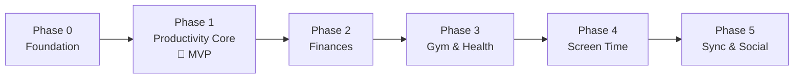

# Roadmap

Phases ship in the order that matches how I'll actually use the app: the streak core first (it *is* the product), then money, then body, then attention, then the network.

| Phase | Delivers | Exit criterion |
| :--- | :--- | :--- |
| [[Phase-0-Foundation]] | Scaffold, design system, l10n, DB, routing | App shell runs in en/ar, light/dark, with an empty field |
| [[Phase-1-Productivity-Core]] | Commitments, plan ritual, streaks, XP, quests, pomodoro, notifications | **I use it daily instead of any other tracker** — installable MVP |
| [[Phase-2-Finances]] | Expense quick-log, budgets, gauge | A month of spending logged in under 5 s/day |
| [[Phase-3-Health-and-Gym]] | Sleep alarm + debt, workout plans & sessions | Alarm replaces my system clock app |
| [[Phase-4-Screen-Time]] | Usage caps, weed-pull interventions (Android) | Caps enforce reliably through a full week |
| [[Phase-5-Sync-and-Social]] | Accounts, MongoDB sync, rankings, widgets, iOS polish | Two devices converge; leaderboard live |

## Working rules

- Each phase ends with a tagged release I install and live with before starting the next — **dogfooding is the QA department**.
- Milestones inside a phase are sequential; tasks within a milestone are the parallel unit.
- Anything discovered mid-phase goes to the phase backlog section, not into scope.
