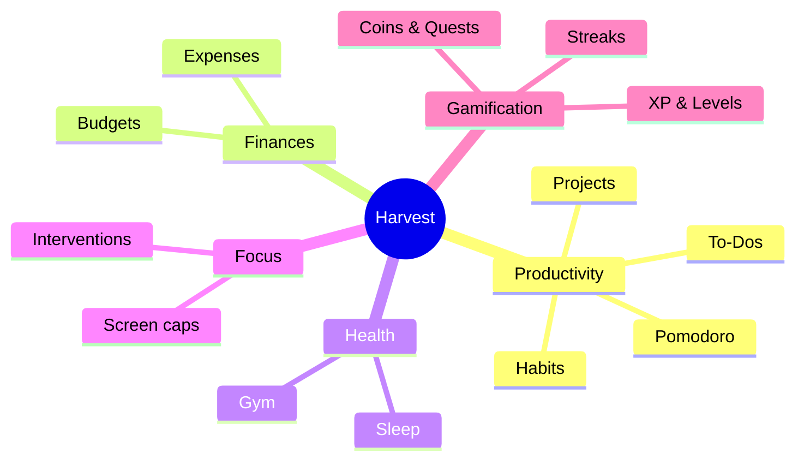

# 🌱 Harvest — Vault Home

*Cultivate your day. Harvest your potential.*

This vault holds everything about Harvest: what it is, how it works, how it's built, and in what order I'm building it. Start with the [[Vision]] if you're new, or jump straight to the [[Roadmap]] to see where things stand.

## Map of Content

### 📖 Overview
- [[Vision]] — why this app exists and what it must feel like
- [[Product-Requirements]] — the consolidated PRD
- [[Glossary]] — shared vocabulary (the farming metaphor, entity names)

### 📋 Specification
- [[Core-Entities]] — the data model: Projects, Habits, To-Dos, and friends
- [[Productivity-Engine]] — commitments, check-ins, the daily plan ritual
- [[Gamification]] — streaks, XP, coins, quests
- [[Pomodoro]] — the focus timer
- [[Notifications]] — the gentle-to-urgent reminder system
- [[Finances]] — expense logging and budgets
- [[Health-and-Gym]] — sleep tracking, alarm, workouts
- [[Screen-Time]] — usage caps and interventions
- [[Onboarding]] — first-run experience
- [[Dashboard-and-Widgets]] — home screen, reports, widgets
- [[Business-Rules]] — the immutable rules (day reset, over-log cap, …)

### 🏗 Architecture
- [[Architecture-Overview]] — layers, data flow, package layout
- [[State-Management]] — Riverpod conventions
- [[Local-Database]] — Drift schema and repositories
- [[Sync-Strategy]] — local-first now, MongoDB sync later
- [[Theming-and-Design-System]] — colors, type, motion, dark/light
- [[Localization]] — English + Arabic, RTL
- [[Notifications-and-Background]] — scheduling, 3 AM reset, alarms

### 🗺 Planning
- [[Roadmap]] — phases at a glance
- [[Phase-0-Foundation]]
- [[Phase-1-Productivity-Core]] ← **the MVP**
- [[Phase-2-Finances]]
- [[Phase-3-Health-and-Gym]]
- [[Phase-4-Screen-Time]]
- [[Phase-5-Sync-and-Social]]

### 🏁 Checkpoints
- [[Checkpoint-1]] — road to v1: progress review, bugs, and the final gap list

### ⚖️ Decisions (ADRs)
- [[ADR-001-State-Management]] — Riverpod over Bloc
- [[ADR-002-Local-Database]] — Drift over Isar/Realm/Hive
- [[ADR-003-UI-Toolkit]] — Material 3 + custom design system
- [[ADR-004-Localization]] — gen-l10n with ARB files
- [[ADR-005-Local-First-Sync]] — outbox pattern toward MongoDB

## The big picture

 make the app have a logo use green asthetics and some icon along the idea of thw app.
  put a seperate tab to manage savings like log a saving and withdraw from saving to keep record of that
  also add a wallet and i can add and withdraw from it a wallet is meant to be spent savinggs are meant to be saved, when I with draw from savnig i get an a prompt to put to wallet or no
  when i log an expense it says withdraw from wlet or no, i can widraw from wallet without loging the expense, and when i withdrwa fom saving it gets logged to either as an expense, or to wallet i always type something in there.
  add debts so i can mange those too  by logging a debt and paying off, a debt is an ammout and to whom its owed (no interest), and pay off by date, and advanced ptions to meind me by, and i keep getting remonded untill the debt is setteled.
  remove the todays quest section and it's logic from the tasks page